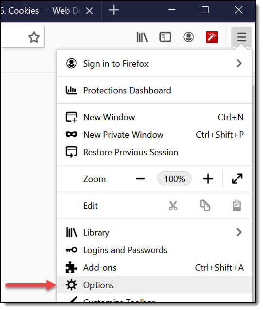
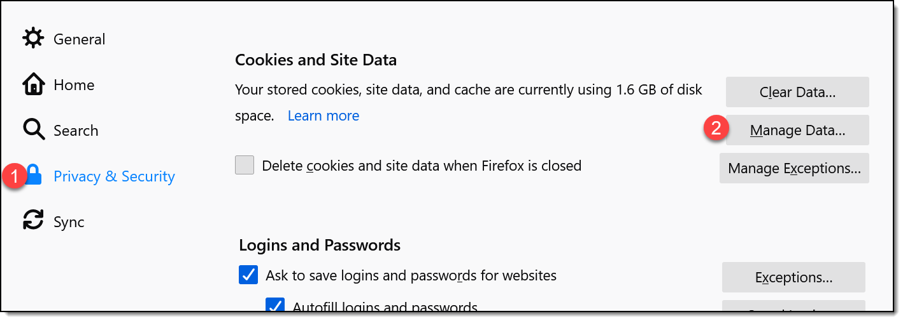
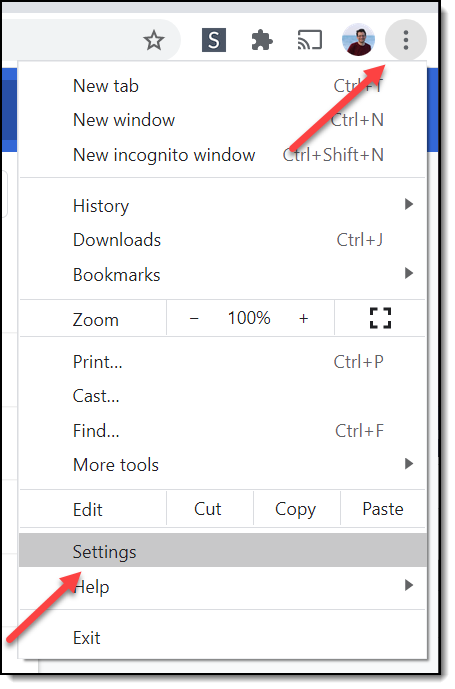
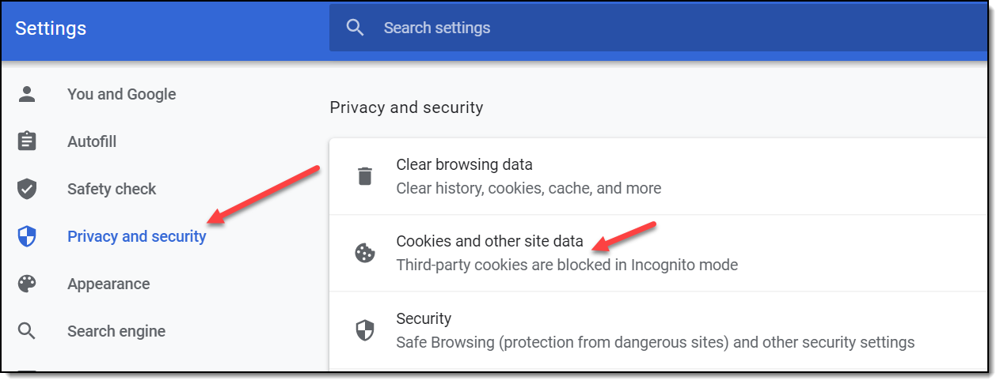
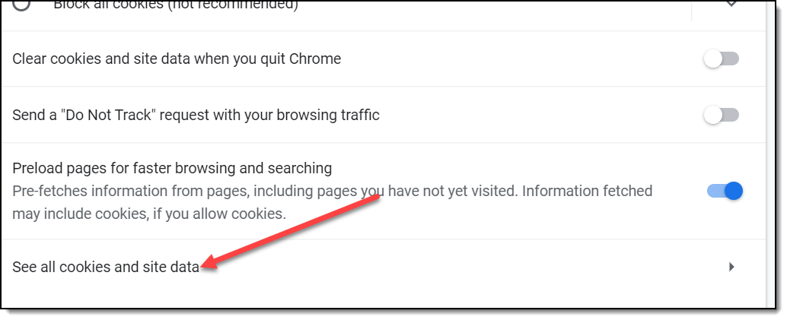
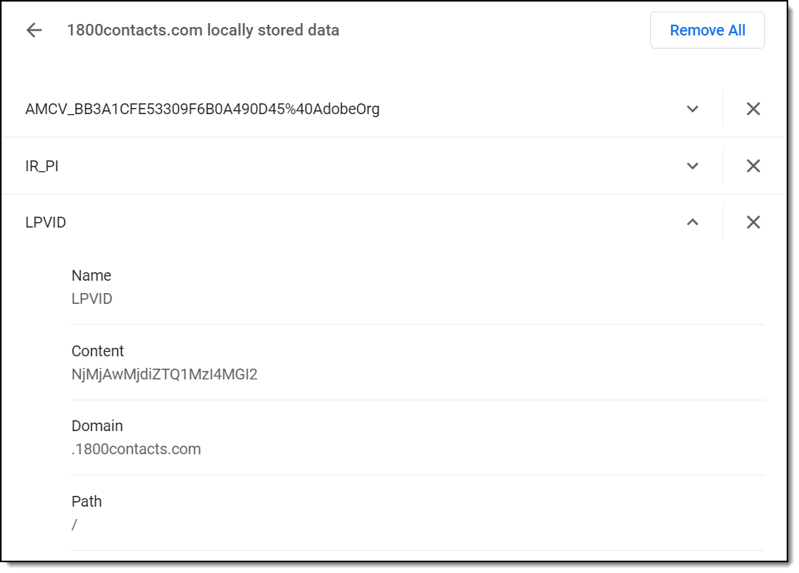
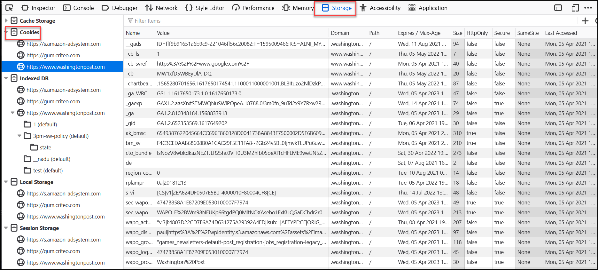

Cookies and Local Storage
=========================

You make have heard about cookies and web pages. What is a cookie, and what
is it used for?

A cookie allows us to track a user from one web page request to the other.
Do people log into your web site? Do you keep information on a per-user
basis? You need cookies!

A cookie allows us to store a simple key/value pair. We can "set" the value.
Each web request made by the user's computer afterwards will contain the key
and the value.

We could set a cookie like this:

``useraccount = paul_craven``

But that would be a *terrible* idea. Why? Cookies can be changed by the
client. All a user would need to do is change the cookie and then they'd be
someone else.

What is usually done?

``session_id = 2304some_really_long_random_string2034902``

We create a session id. This session id is a long randomized string that would be
statistically impossible to guess. Then, on the web server (either in memory or
in a database) we store a table that has session id, a key, and a value.

It is important that if we use a session id, we also use https for our
communications. That will help prevent a person from "sniffing" the session
id and pretending to be a different person.

HTML5 Local Storage
-------------------

Starting with HTML5, web browsers added three new kinds of storage
in addition to cookies:

+------------+-----------+-----------------+-----------------+
| Storage    | Format    | Scope           | Persistence     |
+============+===========+=================+=================+
| Session    | Key/value | Session only	   | Session only    |
+------------+-----------+-----------------+-----------------+
| Local      | Key/value | Across sessions | Across sessions |
+------------+-----------+-----------------+-----------------+
| Database   | Structured| Across sessions | Across sessions |
+------------+-----------+-----------------+-----------------+

What websites are storing cookies?
----------------------------------

Web browsers store the data on your computer. Typically the data will be buried
in a spot like:

``C:\Users\myusername\AppData\Local\Google\Chrome\User Data\Default``

However, there are a couple spots in the web browser where you can look at the
sites that are storing data.

Firefox
^^^^^^^

Click the drop down menu and hit "Options"

Then select Privacy and Security, find the "Cookies and Site Data" section, and
finally "Manage Data."

Then you can see what sites have stored data. Unfortunately with Firefox
you can't quickly browse that data without a browser plug-in.

Chrome
^^^^^^

For Chrome, select the drop-down menu in the upper right and click "Settings."

Then find "Privacy and security", followed by "Cookies and other site data."

Finally "See all cookies and site data."

Finally, find some cookies, expand them out and see the content.

How do you look at cookies from the developer console?
------------------------------------------------------

* Firefox: F12, find "Storage" tab. Look on left side for cookies.
* Chrome: F12, find "Application" tab. Look on left side for cookies.
* Edge: F12, find "Debugger" tab. Look on left side for cookies.

How are cookies really set and transmitted?
-------------------------------------------

Remember how HTML has a "head" section? Confusingly, so does HTTP.
So if we use HTTP to transfer HTML, the HTTP has a head, and the HTML has
a head. They are totally different things.

In the image below, we use the packet tracing tool called Wireshark to see the
data. The "red" data is what comes from the web browser. The "blue" data is what
comes from the web server. It doesn't look like HTML because it is
compressed/zipped.

There are two major parts to a request from the client, and a response from
the server. There's a request head, and a request body. THen there's a response
head and a response body. The body is optional in some cases, such as this
request for a page. There might be a request body if I was sending form data
to the server.

.. image:: cookie_trace_1.png

Cookies are set and passed back in the HEAD section of the HTTP response.

It is up to the client browser to get that cookie, then send it for every subsequent
HTTP request head.

See below for a trace of setting a cookie:

.. image:: cookie_trace_2.png

Cookie Demo
-----------

We want to show how to read and set cookies two different ways.

* With JavaScript on the front-end.
* With Java on the back-end.

Cookies In Javascript
~~~~~~~~~~~~~~~~~~~~~

Here's a screen shot of our end application.

.. image:: cookie_screen.png

Here is the HTML. Nothing really special here. We have a form that takes in
values for the cookie id, and the cookie value that we want to set.

.. literalinclude:: cookie_demo.html
    :linenos:
    :language: html
    :caption: cookie_demo.html

You can read about getting and setting cookies more with
`W3Schools JavaScript Cookie Page <https://www.w3schools.com/js/js_cookies.asp>`_.

Here is our example JavaScript

.. literalinclude:: cookie_demo.js
    :linenos:
    :language: JavaScript
    :caption: cookie_demo.js

Try it! Click `here <../../_static/cookie_demo.html>`_.

Cookies in Java
~~~~~~~~~~~~~~~

How do we get/set cookies on the server-side?
The ``HttpServletRequest`` object pointed to by the ``request`` variable has
a method called ``getCookies()``. This will return a list of the all the cookies.

If there is only one that you want, you need to search the list for it.

.. literalinclude:: GetCookiesServlet.java
    :linenos:
    :language: Java
    :caption: GetCookieServlet.java
    :emphasize-lines: 19

Setting a cookie is a two-step process. You create a ``Cookie`` object, then
add it to the response with ``response.addCookie()``. You can also set a
cookie age, so it will time out after being unused for a while, or when the
browser closes.

.. literalinclude:: SetCookieServlet.java
    :linenos:
    :language: Java
    :caption: SetCookieServlet.java
    :emphasize-lines: 22, 27, 29

Cookie Limits
-------------

Cookies (both keys and values) are limited to about
4000 bytes. This limit is TOTAL per domain. So if
you have two cookies, together they can't have
more than 4000 bytes. For more information see
`cookie limits`_.

.. _cookie limits: http://stackoverflow.com/questions/640938/what-is-the-maximum-size-of-a-web-browsers-cookies-key
