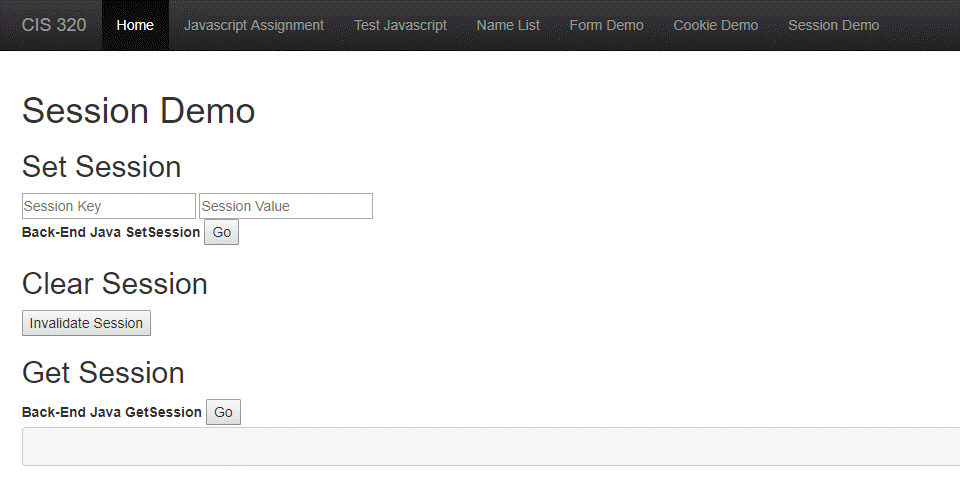

Sessions
========

Java application servers (like Tomcat) have built-in support for *sessions*.
They automatically set a cookie for us, and a table that lets us set key/value
pairs on the server. We can pull those key/value pairs for each session.

Keep in mind, anything you store in session takes up memory. It also goes
away if the server restarts. If you have multiple servers, if the client
request goes to a different server, the session information is not there.

In this section we have three examples:

1. How to set session information.
2. How to get session information.
3. How to delete a session.

.. _session_demo_html:

session_demo.html
-----------------

This is a demo HTML file used as a front-end to show sessions at work.
It looks like:

.. literalinclude:: session_demo.html
    :linenos:
    :language: html
    :caption: session_demo.html

.. _session_demo_js:

session_demo.js
---------------

This is a JavaScript file that will send info back and forth to our server.
There are three scripts, one for setting info, one for getting info, and one
for clearing the session. Each one has its own servlet.

.. literalinclude:: session_demo.js
    :linenos:
    :language: JavaScript
    :caption: session_demo.js

.. _SetSessionServlet:

SetSessionServlet
-----------------

This shows how to set a session variable in a JavaServlet. Only takes a couple
lines of code.

.. literalinclude:: SetSessionServlet.java
    :linenos:
    :language: java
    :caption: SetSessionServlet.java
    :emphasize-lines: 26, 29

.. _GetSessionServlet:

GetSessionServlet
-----------------

This is a more complex 3-in-1 example. We see how to set values, how to fetch
values, how to get all values.

.. literalinclude:: GetSessionServlet.java
    :linenos:
    :language: java
    :caption: GetSessionServlet.java
    :emphasize-lines: 22, 25

InvalidateSessionServlet
------------------------

.. literalinclude:: InvalidateSessionServlet.java
    :linenos:
    :language: java
    :caption: InvalidateSessionServlet.java
    :emphasize-lines: 15, 18