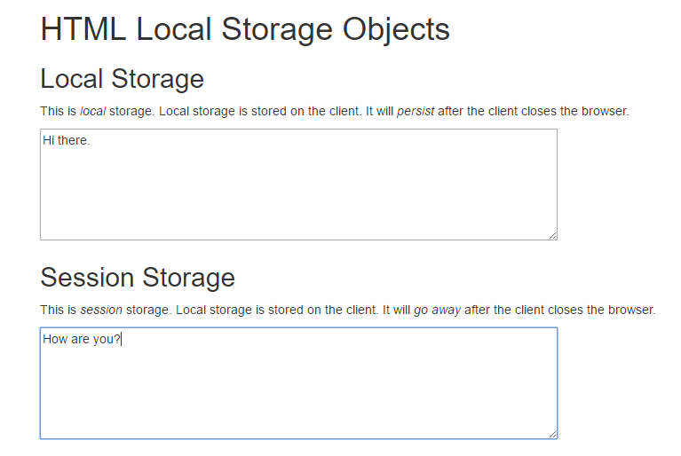

Local Storage
=============

There are other options besides cookies for keeping data associated with
a client. The newest is something called *local storage*.

You can access the local storage from JavaScript using a built in object
named ``localStorage``. Try opening up a console in your web browser and
type it in followed by a period. You can see some of the options.

Using it is easy, the object has ``setItem`` and ``getItem`` methods where
we can store data in key/value pairs.

Anything stored with ``localStorage`` goes away when the browser is closed.
What if we want to keep something between browser sessions? We can use
``sesssionStorage``. It has the same interface.

Screenshot of our sample app in use:

HTML for the sample app. It has the fields we want.

Note that there are no buttons. We run the JavaScript and save after any
change in the form. This can be handy if there's a problem submitting the
form, you don't lose your data.

.. literalinclude:: ../../_static/local_storage.html
    :linenos:
    :language: html
    :caption: local_storage.html

...and here's the fun stuff. The JavaScript.

.. literalinclude:: ../../_static/local_storage.js
    :linenos:
    :language: JavaScript
    :caption: local_storage.js
    :emphasize-lines: 7, 22, 39, 48

Try it out here: `here <../../_static/local_storage.html>`_.

You can store about 10 meg of data combined for the local and session data. This
is way more than the 4000 character limit you get with cookies.

If you need something more structured than simple key/value pairs, you can
create your own database using ``IndexedDB``. Think, you can download a database
and then allow the user to interact with the data all locally. This is WAY faster
than going back and forth from the server for everything.