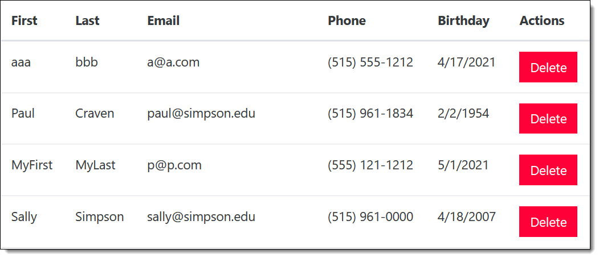

.. _assignment_7:

Assignment 7 - Back-End Validate / Delete a Record
==================================================

The goals of this assignment:

* Learn how to do back-end validation of data.
* Learn how to create a link that passes data to a servlet.
* Learn how to delete records.

Optional Code Clean-Up
----------------------

Before moving on, you might want to revisit your old code and clean it up.
Particularly, if you've taken CMSC 155, you should try doing this.

In the past we've done code like this:

.. code-block:: javascript

    $('#myfield').removeClass("is-invalid");
    $('#myfield').addClass("is-valid");

This isn't great code. Why? When we do ``$('#myfield')`` the JavaScript scans
the entire document, finds the element, and builds an object out of it. Which
is ok to do once. But multiple times? That's waste. It is more efficient to do:

.. code-block:: javascript

    let myfield = $('#myfield')
    myfield.removeClass("is-invalid");
    myfield.addClass("is-valid");

Now we only scan the document once!

Also, our validation is repetitive. We can move our validation into a function.

.. code-block:: javascript

    function fieldValidate(field, regex) {
        // etc, set a boolean to valid or not
        return valid;
    }

    function saveChanges() {
        // etc
        let firstNameField = $('#firstName');
        valid = fieldValidate(firstNameField, /^[^0-9]{1,10}$/);
        if (!valid) success = false;

Requirements
------------

Step 1 - Back-End Validate
^^^^^^^^^^^^^^^^^^^^^^^^^^

Update your code to edit a record so that it also validates on the back-end.
Refresh your memory on how to do this by looking at :ref:`validate_backend`.
Don't insert the record if it fails the validation.

So that you can easily send bad data, you will need to temporarily
disable your front-end validation (the JavaScript) to test the code.
Remember you can hit ctrl-/ to disable sections of code.

Go ahead and re-enable the JavaScript checks when done with this section.

Step 2 - Add a Button
^^^^^^^^^^^^^^^^^^^^^

* Go to your JavaScript code.
* Find where you update the table and add in the rows. Might be called ``updateTable``.
* Update your row appending code to include a button in a table cell. Like:

  .. code-block:: text

      <td>
        <button type='button' name='delete' class='deleteButton btn btn-danger' value='id'>
          Delete
        </button>
      </td>

  * Note that you will need to replace ``id`` with whatever variable holds that id.
    I'm leaving that up to you to figure out.
  * You'll need to intelligently figure out how to place that HTML. Watch your
    cell starts, ends, and table row starts and ends. It is easy to mess that up.
  * Update your ``name_list.html`` page so the table has an extra column. I
    just called the header 'Actions'.

* Test to make sure the button shows up and the table structure looks right.

Step 3 - Add JavaScript
^^^^^^^^^^^^^^^^^^^^^^^

* Create this JavaScript function in your js file:

.. code-block:: JavaScript

    function deleteItem(e) {
        console.log("Delete");
        console.log(e.target.value);
    }

* Back in your ``updateTable`` function, *after* adding the rows to the table, hook
  this new delete item function to all your buttons:

    .. code-block:: JavaScript

        var buttons = $(".deleteButton");
        buttons.on("click", deleteItem);

    Alternatively you can do it in one line:

    .. code-block:: JavaScript

        $(".deleteButton").on("click", deleteItem);

    It is nice that works not just for one button, but for every button matching that
    class.

    .. tip::

       This does not go at the end of your file like other buttons. Why? Because the
       delete button has not been created yet.

       Also, don't add the hook inside your ``for`` loop, or you'll add lots of
       hooks for each button.

* Test the button and make sure it prints the proper id to your console.
* Create JavaScript to post to ``api/name_list_delete``. It should look
  a lot like the JavaScript for adding a new record, except the only thing
  we will pass is the id of the record we are deleting. That will shorten your
  code a lot. Test, and make sure it attempts to post the data. (You're script
  will get a 404 of course.)
* Make sure your JavaScript calls ``updateTable`` just like you do when adding a
  person so that the table updates after record deletion.

Step 4 - Add Servlet
--------------------

Now we need a servlet that will delete the records.=

* Create a servlet that will delete the record based on the id. Pattern the
  servlet after the ``NameListEditServlet`` class. It will be very similar.
* Call it ``NameListDeleteServlet`` or similar. Make sure the servlet name and
  the class name match. We don't want a servlet name collision!
* Make sure it maps to ``api/name_list_delete``.
* The only field you should be receiving is the id. Don't forget to validate it,
  unless you've mapped it to an integer. Then there's no need.
* Instead of calling ``PersonDAO.addPerson()`` call ``PersonDAO.deletePerson()``.
* Create a method in ``PersonDAO`` called ``deletePerson``. I'd copy ``addPerson``
  and use it as a template.
* Your SQL should look like:

  .. code-block:: SQL

     delete from person where id = ?

Step 5 - Test
-------------

* Make sure you can delete your record ok.
* Make sure that it automatically updates the table after you hit the delete button
  and the user doesn't have to hit refresh to see the record go away.

Turn in
-------

* A GitHub URL to the source code for where your back-end validation happens.
* An Amazon URL to your code where I can confirm that records are deleted.
