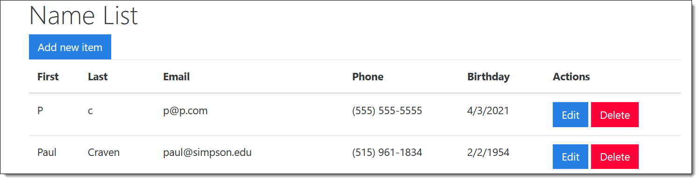

Assignment 8 - Edit a Record
============================

Our goal with this assignment is to create an "edit" button that lets us edit
a record. We will use a lot of the same code that we already have, and add
the following:

* Front-End

    * We will add an "edit" button alongside the "delete" button.
    * When the user selects edit, we will open the dialog box for "add", except
      we will pre-fill it with the values we are editing.
    * Here's the kicker. Rather than having a blank id, we will also pre-fill in
      the record id.

* Back-End

    * If we are sent an id, rather than insert a record into the database, we will
      use the SQL to do an "UPDATE" rather than an "INSERT".

Detailed Requirements
---------------------

Here are the detailed instructions to get this working.

Step 1 - Add an Edit Button
^^^^^^^^^^^^^^^^^^^^^^^^^^^

* This will be a lot like your "delete" button you have now. Keep it. Add an
  edit button.
* Go to your JavaScript code.
* Find where you update the table and add in the rows.
* Create a string that will have the HTML for a "edit" button. It should look
  something like:
  ``+"<button type='button' name='edit' class='editButton btn btn-primary' value='" + id + "'>edit</button>"``.

  * The delete edit button should appear before the delete button.
  * Note that you will need to replace ``id`` with whatever variable holds that id.
  * You'll need to adjust the table tags. I put both buttons in the same cell.

* Test to make sure the button shows up.

Step 2 - Add JavaScript Edit Button Hook
^^^^^^^^^^^^^^^^^^^^^^^^^^^^^^^^^^^^^^^^

Create this JavaScript function in your js file:

.. code-block:: JavaScript

    function editItem(e) {
        console.debug("Edit");
        console.debug("Edit: " + e.target.value);
    }

Back in your ``updateTable`` function, after adding the rows to the table, hook
this new edit function to all your buttons:

.. code-block:: JavaScript

    let buttons = $(".editButton");
    buttons.on("click", editItem);

Alternatively you can do it in one line:

.. code-block:: JavaScript

    $(".editButton").on("click", editItem);

It should go just right by your code to hook in the delete button.

Test the button and make sure it prints the proper id to your console.

Step 3 - Open Edit Window
^^^^^^^^^^^^^^^^^^^^^^^^^

Next, pop up the "edit" dialog, and fill it in with all the data values.

There are two ways this could be done. The more 'standard' way would be to:

* Make a new servlet that returns a customer record in JSON given an id
* Use JavaScript to fall that servlet, then populate the fields

But in this case we have all the data in our table already. We can use this example
to show some complex JavaScript navigation to pull the info we need out of the
table.
Here's what the code for that would look like. Read the comments carefully.

.. code-block:: JavaScript

    // Grab the id from the event
    let id = e.target.value;

    // This next line is fun.
    // "e" is the event of the mouse click
    // "e.target" is what the user clicked on. The button in this case.
    // "e.target.parentNode" is the node that holds the button. In this case, the table cell.
    // "e.target.parentNode.parentNode" is the parent of the table cell. In this case, the table row.
    // "e.target.parentNode.parentNode.querySelectorAll("td")" gets an array of all matching table cells in the row
    // "e.target.parentNode.parentNode.querySelectorAll("td")[0]" is the first cell. (You can grab cells 0, 1, 2, etc.)
    // "e.target.parentNode.parentNode.querySelectorAll("td")[0].innerHTML" is content of that cell. Like "Sam" for example.
    // How did I find this long chain? Just by setting a breakpoint and using the interactive shell in my browser.
    let first = e.target.parentNode.parentNode.querySelectorAll("td")[0].innerHTML;
    // repeat line above for all the fields we need

    $('#id').val(id); // Yes, now we set and use the hidden ID field
    $('#first').val(first);
    // Etc

    // Show the window
    $('#myModal').modal('show');

This works ok except for a couple fields, phone and bithday.

The phone number (at least for me)
is displayed as ``(515) 555-1212``. But for input, we want ``515-555-1212``.
We can use regular expression groups to pull out each part of the phone number,
then put it together. See below.

.. code-block:: JavaScript

    // Regular expression to match phone number pattern:
    // (515) 555-1212
    let regexp = /\((\d{3})\) (\d{3})-(\d{4})/;
    let match = phone.match(regexp);
    // Log what we matched
    console.log("Matches:");
    console.log(match);
    // We how have a list, 1-3, where each one is part of the phone number.
    // Reformat into 515-555-1212
    let phoneString = // fill this part in
    $('#phone').val(phoneString);

Next, the birthday. We get 1/2/1950, but need 1950-01-02. Here we use a different
method. We pase the date, create a JavaScript date object, then format to an
ISO standard date string: ``1950-02-01T06:00:00.000Z``.
But that also includes time! So we split that off.

.. code-block:: JavaScript

    // Parse date to current time in milliseconds
    let timestamp = Date.parse(birthday);
    // Made date object out of that time
    let dateObject = new Date(timestamp);
    // Convert to a full ISO formatted string
    let fullDateString = dateObject.toISOString();
    // Trim off the time part
    let shortDateString = fullDateString.split('T')[0];

All the fields should work ok except the birthday field. We pull 1/2/1950 from
the table, yet the field expects 1950-01-02 instead.

Step 4 - Update the Servlet
---------------------------

* Create a new ``PersonDAO`` method for updating a record. The SQL code looks
  something like:

.. code-block:: sql

  update person set first=?, last=? where id=?

Update your servlet for adding a new record.

* If no id was sent to us, then insert the record as we did before.
* If we did get an id, call the update method on the PersonDAO instead of the
  add method.
* Test it out.

Turn in
-------

* GitHub URL
* An Amazon URL
