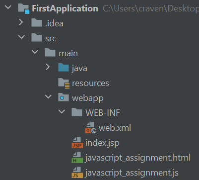

Assignment 2 - First JavaScript Assignment
==========================================

Take the HTML code at the end of this assignment, and then write a JavaScript
file to complete the five parts. Please use jQuery where appropriate.

Four points for each part.

To get set up and turn it in:

* Create a file called ``javascript_assignment.html`` in the IntelliJ project
  you created from our last assignment.
  Put the HTML file in the "web" folder. **Don't** put it in the WEB-INF folder.
* Copy the HTML page I've got for you WAY at the end of this assignment into
  ``javascript_assignment.html``.
* Create a file called ``javascript_assignment.js`` in your IntelliJ project in
  the same folder. Your setup should look like:

* Rather than go through the "redeploy" process, just open the original
  source file in your web browser. (Right click on the HTML file, hit "show
  in explorer", then toss that file into your favorite web browser.)
  When we working with the database we will
  have to go through the run/deploy process. But since we are just doing JavaScript
  we can skip that.
* Put a simple ``console.log.("Test");`` into the js file. Refresh your
  web page and make sure you can see the test. If it works, then delete that
  line and move on.
* Write the JavaScript to solve all five parts descripted below.
* Hover over the IntelliJ bar on the right side where there are little "suggestion"
  and error lines. See if there are any improvements in style to make.
* Build a WAR file.
* Deploy it.
* Confirm it still works. (You'll need to navigate directly to the file.)
* Paste in a GitHub link to your JavaScript, and a link to your working application
  on Amazon.

Part 1
------
Write an application that will print out "Hello" to the console every time
the user hits the button.

Do NOT modify the HTML file I'm giving you. Only put your JavaScript code in
the JavaScript file. Do NOT use the ``onclick`` directive for hooking a function
to a button. Instead pull from the example and do something like:

.. code-block:: JavaScript

    // Your Function
    function myFunction(event) {
        // Your code here
    }

    // Attach a button with the id of 'button1' the function above
    var formButton1 = $('#button1');
    formButton1.on("click", myFunction);

Part 2
------

For part two, use jQuery to pull the values of the first two fields, convert
them to numbers, and add them. Then put the result in the third field.

.. image:: part2.png

Part 3
------

Toggle the paragraph to be hidden and not hidden. Remember, most of
the code you need is already in :ref:`jQuery` example code I showed.

Part 4
------

User regular expressions to validate the following field. Remember, most of
the code you need is already in :ref:`jQuery` example code I showed.

Part 5
------

Create a JSON string out of the form fields below. Remember, most of
the code you need is already in :ref:`jQuery` example code I showed.

.. image:: part5.png

.. literalinclude:: javascript_assignment.html
    :linenos:
    :language: html
