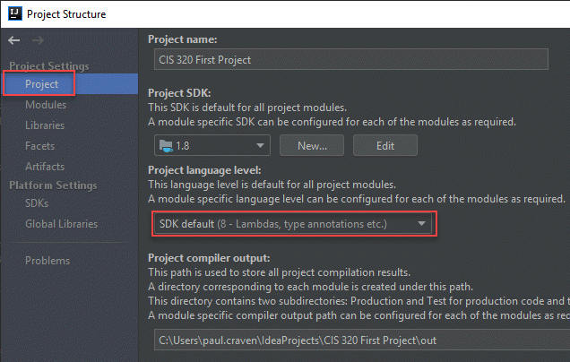

.. _list_records:

Assignment 3 - List Records Part 1
==================================

The goal of this assignment is to create a Java Servlet that will output the
content of a database table in JSON format.

Complete
--------
* Create a database with a Person table as outlined in :ref:`setup-amazon-db`.
* :ref:`manage-connections`

Your program output should look like:

.. code-block:: JSON

    [{"id":1,"first":"Paul","last":"Craven"},{"id":2,"first":"Sam","last":"Simpson"}]

Your browser may format the output nicely, but the raw output should look
like that text.

Make sure you list out for each record:

* id
* First name
* Last name
* E-mail address
* Phone number
* Birthday

Build the .WAR file. Upload to AWS, replacing the original project.

Turn in
-------

* GitHub URL for your project.
* URL for the Amazon web services that links to your working servlet that spits
  out JSON.

.. _common-issues:

Common Issues
-------------

* I don't know how to test my servlet - Run ``/index.jsp``. Change ``index.jsp`` on
  your web browser to ``/api/name_list_get``. Test that link. Works on your
  local server, or the AWS server.
* I just get empty output like ``[]`` - Look at your server log.
  Errors you care about
  will have a long stack trace. Practice reading the stack trace to figure out
  the error.
* Doesn't work on AWS. - You can download the last 100 lines of your log to get
  a clue what is wrong. Search for the option.
* AWS says something about a mis-match in class version. If you compile your project
  with Java 10 and AWS expects Java 8, you'll get an error. You can select "Project Structure"
  from IntelliJ and set your SDK to compile to an earlier version:

* AWS says something about the connection pool - Copy ``tomcat-dbcp.jar`` from
  ``/wherever_tomcat_is/tomcat/lib`` to your ``WEB-INF/lib`` folder. Redeploy. That jar file
  has the connection pool code, which for some reason isn't included on Amazon.
* Huge long pause when connecting - Can't get through your firewall. Just change
  your security to accept connections from anywhere. That's totally the wrong
  way to do it, but I haven't figured out the proper way yet.
* Doesn't like the log function - Don't forget to create the logger::

    private final static Logger log = Logger.getLogger(MyClassHere.class.getName());
