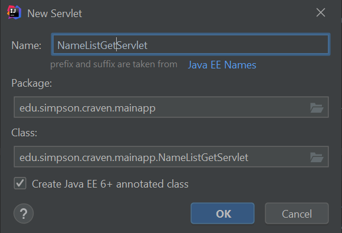

.. _list_records:

Assignment 3 - List Records Part 1
==================================

The goal of this assignment is to create a Java Servlet that will output the
content of a database table in JSON format.

Complete
--------
* Create a database with a Person table as outlined in :ref:`setup-amazon-db`.
* Create a package for your Java files. For example, ``edu.simpson.cis320``.
  You might already have a package created, feel free to use that as well.
* Load the MySQL and GSON code libraries as shown in :ref:`importing-libraries`
* Create a ``DBHelper`` class and populate it with the code from the tutorial:
  :ref:`db-helper`
* Create a business object called ``Person`` with fields for id, first, last,
  email, phone, and birthday. Also create getters and setters for those
  fields. Here's something to get you started:

.. code-block:: Java

    public class Person {

        private int id;
        private String first;
        private String last;
        private String phone;
        private String birthday;

        public int getId() {return id; }
        public void setId(int id) { this.id = id; }

        public String getFirst() { return first; }
        public void setFirst(String first) { this.first = first; }

        /* Add additional getters and setters for each field.
           Just follow the same pattern. */
    }

* Create a ``PersonDAO.java`` file, following the code in :ref:`person-dao`.
  Follow the pattern and expand it to include phone, and birthday.
* Create a servlet called ``NameListGetServlet``,
  as shown in `create-servlet`. Make it in the package
  you created.

* Update the servlet mapping for your ``NameListGetServet`` to read:

.. code-block:: Java

    @WebServlet(name = "NameListGetServlet", value = "/api/name_list_get")

* Let's do another 'hello world' and just have our servlet print so we know it
  works:

.. literalinclude:: NameListGetServlet.java
   :linenos:
   :language: java
   :caption: NameListGetServlet.java

* Start the servlet engine.
* Test the servlet. You'll have to manually replace ``index.jsp`` with your
  servlet URL which is ``/api/name_list_get`` if you followed the tutorial.
* Even if that works, comb through the errors thrown during startup.
  Take a look at the :ref:`common-issues` at the end
  of this document for how to solve things.
* Take the ``PersonDAO`` class and update ``getPeople()``
  to return all the fields. Read the comments and get a feel for what the code does.
* Update our servlet to call ``getPeople()`` and print the number of records. Test
  it.

.. literalinclude:: NameListGetServlet2.java
   :linenos:
   :language: java
   :caption: NameListGetServlet.java

* Update the servlet to the example JSON code where we call the DAO and then
  use GSON to convert it to JSON format for us.
  See :ref:`name-list-get-servlet`
* Have the servlet print out JSON for the **all** fields in the database. Something
  like this, but with more fields:

.. code-block:: JSON

    [{"id":1,"first":"Paul","last":"Craven"},{"id":2,"first":"Sam","last":"Simpson"}]

* Validate your JSON file with `JSON Lint`_.

.. _JSON Lint: http://jsonlint.com/

Make sure you list out for each record:

* id
* First name
* Last name
* E-mail address
* Phone number
* Birthday

Turn in
-------

* GitHub URL for your project.
* URL for the Amazon web services that links to your working servlet that spits
  out JSON.

.. _common-issues:

Common Issues
-------------

* I don't know how to test my servlet - Run ``/index.jsp``. Change ``index.jsp`` on
  your web browser to ``/api/name_list_get``. Test that link. Works on your
  local server, or the AWS server.
* Can't import mysql, because I get an error like ``Caused by: java.lang.ClassNotFoundException: com.mysql.jdbc.Driver``
  in the Tomcat console. You are missing the database driver code.
  Modern fix, follow :ref:`importing-libraries`.
  Old school hix: Download the
  ``mysql-connector-java-8.0.23.jar`` file. I've got it on Moodle, but you
  can Google it too and
  `download it from Oracle <https://dev.mysql.com/downloads/connector/j/>`_.
  Create a
  ``WEB-INF/lib`` directory and put the jar file there.
* IntelliJ can't import servlet classes and gives you an error like
  ``Error:(5, 52) java: package javax.servlet.http does not exist``
  To fix, go to file...project structure...libraries,
  add the library ``/whereever_you_installed_tomcat/lib/servlet-api.jar``
* If you get a "File not found" when trying to go to your ``http://localhost:8080/CIS_320_First_Project_war_exploded/api/name_list_get``
  or whatever, make sure your servlet mapping in ``web.xml`` is updated from the default.
* Can't import gson classes - Download the ``gson-2.8.5.jar`` file from the class
  website. Put in
  ``WEB-INF/lib`` directory. Add it to project structure.
* I just get ``[]`` - Look at your server log. The first error your server
  generates you can ignore. The second error is probably your issue. Errors you care about
  will have a long stack trace. Practice reading the stack trace to figure out
  the error.
* Doesn't work on AWS. - You can download the last 100 lines of your log to get
  a clue what is wrong. Search for the option.
* AWS says something about a mis-match in class version. If you compile your project
  with Java 10 and AWS expects Java 8, you'll get an error. You can select "Project Structure"
  from IntelliJ and set your SDK to compile to an earlier version:

.. image:: sdk_version.png

* AWS says something about the connection pool - Copy ``tomcat-dbcp.jar`` from
  ``/wherever_tomcat_is/tomcat/lib`` to your ``WEB-INF/lib`` folder. Redeploy. That jar file
  has the connection pool code, which for some reason isn't included on Amazon.
* Huge long pause when connecting - Can't get through your firewall. Just change
  your security to accept connections from anywhere. That's totally the wrong
  way to do it, but I haven't figured out the proper way yet.
* Doesn't like the log function - Don't forget to create the logger::

    private final static Logger log = Logger.getLogger(MyClassHere.class.getName());
