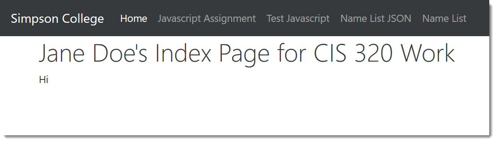

.. _list-records-final:

Assignment 4 - List Records Part 2
==================================

For this lab we are going to:

* Create a new ``index.html`` page that links to everything.
* Create a page we'll use to create, read, update, and delete records.
* Write JavaScript to call our JSON servlet from the prior lab
* Insert those records into the table

Create a Landing Page
---------------------

Ok, this is probably past due, but let's make a decent landing page.
Delete the ``index.jsp`` file that comes with your default servlet.
Create a new ``index.html``.

Inside the page, use this simple Bootstrap index page.
(We covered Bootstrap last semester.)

Anyway, make this your ``index.html`` page. Adjust the links in the page as
needed so they work with your project if needed. And replace "Jane Doe" with your
name. If you want, swap out the theme to something you like.

.. literalinclude:: index.html
    :linenos:
    :language: html
    :caption: New index.html page

Create the CRUD Page
--------------------

Now we need a page with a table on it. Create a new page called ``name_list.html``.
This page has the table to list our records, and a form that's initially
hidden.
Eventually, we need that form so we can
enter and edit our data. While won't use the form in this assignment, but we will
need it for a
later assignment.

.. literalinclude:: name_list.html
    :linenos:
    :language: html
    :caption: New name_list.html page for our CRUD app

There's nothing new or special about these pages above, they plain HTML/CSS.
Except,
note that the second page loads a file called ``js/name_list.js``. This is our file with
our program we are about to write.

Create the JavaScript Page
--------------------------

Let's keep our JavaScript separate from our HTML and Servlet code.
Create a ``js`` directory under the ``web`` folder in your project.

To keep things simple, let's just test to make sure our new js file is
loading and works. Put this in your ``name_list.js`` file.

.. code-block:: JavaScript
    :caption: JavaScript ``js/name_list.js`` file

    console.log("Hi, this is a test.");

Deploy locally and navigate to the ``name_list.html`` page.
Make sure you can see the test message in the console.
If you are getting a 404 error while loading the name list page,
you might not have linked up to the JavaScript
file quite right. Also, remember that capitalization matters when you deploy
it, but not while on your Windows machine.

When you get it working, you'll want to expand the JavaScript to put everything
in a function. Like:

.. literalinclude:: name_list.js
    :linenos:
    :language: JavaScript

Call JSON Servlet
-----------------

Now, go back to :ref:`make-json-calls` and adapt that code so you call your
``get_name_list`` and output the names to the console.

Add Records to Table
--------------------

When you get that working, you need to write jQuery JavaScript that will add those
records to your table.

You can select a table called ``myTable`` (yours has a different id, look it up)
using jQuery with:

.. code-block:: JavaScript

    $('#myTable')

We want to select the last row in that table. Right now it says 'No data'. We
want to get rid of that, and and our data. You can select the table row with the
``tr`` selector, and the last row with ``tr:last``.

.. code-block:: JavaScript

    $('#myTable tbody:last')

You can add a row to the end with:

.. code-block:: JavaScript

    $('#myTable tbody:last').after('<tr><td>Hi</td><td>there</td></tr>');

Make sure your table lists out the following:

* id
* First name
* Last name
* E-mail address
* Phone number
* Birthday

Clear Record Line
-----------------

After adding new records to the table, you likely still have the first
record that says "No data". We need to get rid of that.

Remember, you can select the last row of a table with:

.. code-block:: JavaScript

    $('#myTable tbody:last')

How can you select the first row?

Once you figure that out, you can remove an item with the ``.remove()`` method.

Turn it in
----------

Turn in:

* GitHub URL to the .js file
* Link to Amazon server with working list of records
