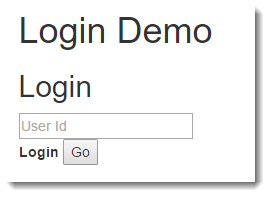
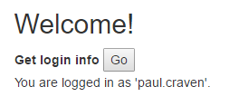

Assignment 9 - Login Lab
========================

The goal of this lab is to use cookies and sessions to run the basics of
managing login and logout. If we had just a *bit* more time we'd create
a full system. But even with this short assignment, you can learn a lot
of what you need.

Login Lab Steps
---------------

1.  Start with the Session demo page. See :ref:`session_demo_html`.
2.  This is going to be our login page, so let's name it that way.
    Rename the file from ``session_demo.html``, to ``login.html``.
3.  Create a JavaScript page. See :ref:`session_demo_js` as it can be a good
    starting template for our page.
    But instead of ``session_demo.js`` call it ``login.js``. Make sure you update
    the HTML document from step 1 to import this file.
4.  Create a ``GetLoginServlet`` class in Java. Pattern it off the
    :ref:`GetSessionServlet`.
5.  Update the servlet name and the URL link. A URL such as ``get_login_servlet``
    would be good.
6.  Create a ``LoginServlet`` class in Java. Use the code out of
    :ref:`SetSessionServlet` to start.
7.  Map the ``LoginServlet`` to a URL of ``login_servlet`` and make sure the
    servlet has a unique name.
8.  Create a ``LogoutServlet`` class in Java. Use the code out of
    :ref:`InvalidateSessionServlet` to start.
9.  Map the ``LogoutServlet`` to a URL of ``logout_servlet`` and make sure the
    servlet has a unique name.
10. Update the JavaScript file to use these new names. Use ``login`` instead
    of ``setSessionJava`` and ``getLogin`` instead of ``getSessionJava``. Update
    button names to something that matches as well.
11. After all this copying and renaming, get things up and running so you can
    set session variables like the demo.
12.  Don't allow the user to select the session key. Delete the field from the
     HTML. Rename the field so it is ``loginId`` rather than ``sessionValue``.
     Update the JavaScript to just send the login id. Update the servlet to just
     take the login id.
     Always use ``loginId`` in your Java file as the session key.
     (For some reason people find this more difficult than it is. Instead of
     ``sessionKey`` use ``"loginId"``. Don't use a variable, use a string.)
     Test to make sure it works.

13. "Rebrand" the "Clear session" section so that it instead looks like a "Logout".

14. "Rebrand" the Get Session section so that it shows who you are logged in as.
    If you are logged in.
    Update the servlet too. You can simplify it a lot by just doing something
    like ``String loginId = (String)session.getAttribute("loginId");``

15. Automatically call the 'get session' part on page load. At the end of your
    ``login.js`` script, just call the function.
16. Automatically call the 'get session' part when the user logs in.
17. Automatically call the 'get session' part when the user logs out.
18. Hide the logout section if the user isn't logged in. To do this at the end of your
    get session function, check the result and see if you should show or hide
    the logout section. Note that the info you get back from the servlet will
    be a string. If it returns a ``null`` then it will be a string ``"null"``
    not the value ``null``. Also, the string may have extra carriage returns
    and/or spaces so you really get back ``null[space][cr]``. You might need
    to trim the string.

