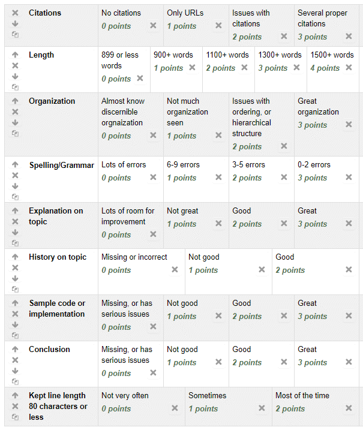

Assignment 11 - Final Research Project
======================================

Goals
-----

* Demonstrate that you can research, learn, understand, and apply a new technology.
* Demonstrate that you can communicate what you have learned. (1500+ words)
* Show that you can review for content, structure, and grammar.
* Be able to listen to feedback and revise your work.

The GitHub for our work will be at:

https://github.com/pvcraven/2019_spring_web_dev

You can see the results at:

https://2019-spring-web-dev.readthedocs.io/en/latest/

Pick a Topic
------------

My suggestion is to pick one of the following topics:

* AngularJS_: A front-end framework for working with interactive data. It is
  great for creating multi-screen input dialogs. It can help with data-binding
  so that you aren't constantly messing around with the DOM trying to update
  stuff.
* NodeJS_: A back-end framework. You can create your own web server with
  JavaScript (instead of Java) with NodeJS.
* `Continuous Integration`_: Show how to create a project that you can check
  into GitHub, have it automatically build. Run test scripts. Run coverage
  reports. And automatically deploy to a testing environment. You don't have to
  do this with a web app if you don't want to. Try getting any type of app working
  with AppVeyor_.
* Accessibility. Talk about how to make the web accessible. Show issues/solutions
  with web sites where you use a screen reader. Try navigating a website without
  a mouse. Try navigating with speech recognition software.
* Responsive web. How can you write a website that looks good on mobile, print,
  and 4k monitors? Dig into the details on how to come up with the CSS. Maybe
  try using "Stylebot" plug-in for Chrome and find how to write CSS that will
  allow degree Simpson's audits to print in a sane matter
* `Google Accelerated Mobile Pages`_. Have your website load faster on the phone.
* `Progressive Web App`_. Run web pages, even without a web connection?
* ReactJS_. JavaScript library for user interfaces.
* D3_. Graphs, graphs, and more graphs in JavaScript.
* Vue_. JavaScript library for creating apps.
* TypeScript
* .NET
* Drupal
* Data presentation (Lambdas, Jupyter notebook)

.. _AngularJS: https://angularjs.org/
.. _NodeJS: https://nodejs.org/en/
.. _New ES6 Features: http://es6-features.org/
.. _Continuous Integration: https://en.wikipedia.org/wiki/Continuous_integration
.. _AppVeyor: https://www.appveyor.com/
.. _Google Accelerated Mobile Pages: https://www.ampproject.org/
.. _Progressive Web App: https://developers.google.com/web/progressive-web-apps/
.. _ReactJS: https://reactjs.org/
.. _D3: https://d3js.org/
.. _Vue: https://vuejs.org/v2/guide/

If you pick a different topic, please get pre-approval. I picked these topics
because in talking with Simpson alumni, these have been the top suggested things
that to learn.

Angular
^^^^^^^

Tutorial: https://www.w3schools.com/angular/default.asp

NodeJS
^^^^^^

You can download NodeJS_ and follow one of the tutorials on-line.

Tutorial: http://www.tutorialspoint.com/nodejs/

Continuous Integration
^^^^^^^^^^^^^^^^^^^^^^

Create a sample project have have it use some of the
popular Continuous Integration Tools.

There are several here:

http://www.tutorialspoint.com/nodejs/

I've used:

* GitHub
* AppVeyor
* Travis
* Coveralls

Phases
------

Below are the phases that we'll run through as part of this project.

Research
^^^^^^^^

First, take time to learn to understand your topic. Build a list of good
sources for citations. Follow along with the sample code they give you.
Make notes.

Second, create your own sample code. By this, I don't mean just take
their sample code and change a few variable names. I mean toss the tutorials and
samples you looked at while researching and start from scratch on your own
project.

Communicate
^^^^^^^^^^^

* First, start with the class GitHub project. Find your page.
* Next, make sure you can
  build locally so you don't have to wait for ReadTheDocs to update. That's a
  horrible, inefficient way of doing things. You can't see the error messages, and
  it takes three minutes to see your output instead of ten seconds.
* Then, create an outline of what you want to cover. Probably include things
  like:

  * What is it?
  * What would you use it for?
  * History
  * Simple sample and explanation
  * More complex sample
  * Screen shots (Use a trial of SnagIt or use the Windows snipping tool)
  * Code samples
  * Conclusion / reflection with your thoughts on using it

* Try to avoid 1st/2nd person references.
* Use citations.
* Must be at least 1,500 words.
* I recommend writing your introduction last. Make sure you include a
  clear thesis statement. Anyone reading it should be able to find it and
  underline it. Make very sure there aren't typos or grammatical errors in
  the first paragraph. That's what sets the tone. Don't put a quote and
  definitely don't put a quote of a definition in your introduction.
* Make sure the conclusion brings in specific parts of your paper. Don't let it
  be so generic you could put your conclusion at the end of someone else's paper
  and still have it work.
* Most paragraphs should have a Purpose. Followed by Information. Followed by an
  Explanation. (PIE) Avoid large walls of text.
* Learn how to include code samples in restructured text.
  Don't include code samples by using an image. People can't copy/paste your
  sample and it won't be picked up by search engines.
* If you screen shot a window, resize it so you don't have 90% whitespace.
* Size images according to the size of the text on the page. Don't have your
  image be huge because you don't bother to size it correctly.
* With bulleted lists in restructured text, you have to indent each following
  line to match the bullet. For example:

.. code-block:: text

  * Test text.
    And more text part of the bullet.
  * But this won't work because
  the next line isn't indented to match.

Review
^^^^^^

We will spend class on 4/23 doing review on each other's work.

Revise
^^^^^^

You can use the feedback from 4/23 and have more time to improve your paper.
Final copy is due Tues. April 30 at 10:00am

Schedule
--------

* 4/4 (work)
* 4/6 (work)
* 4/11 (research due, will be reviewing in class)
* 4/13 (communication due, will be reviewing in class)
* 4/18 (In-class, peer revision. Will be reviewing in class)
* 4/25 at 10 am Final is due. You don't have to show up for the final, but
  paper must be turned in.

Grading
-------

50 points

Rubric
------

