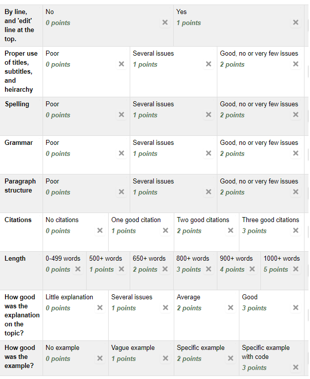

Assignment 7 - Security Report
==============================

Write a report detailing application security.

Pick a Topic
------------

Attack Vectors
^^^^^^^^^^^^^^

* Directory Traversal / Poisoned File Upload
* SQL Injection
* Cross-site scripting / HTML injection
* Denial-of-Service (Don't talk about DDOS)
* Distributed Denial-of-Service  (You can assume DOS is understood)
* Dictionary attack, Brute Force Password Attack
* Unvalidated Redirects and Forwards
* Known vulnerabilities databases, and how they can help both "good"
  and "bad" system administrators.
  See www.exploit-db.com for an example of a vulnerability database.
* Social Engineering
* Buffer overflow
* Trojan horses

How to Secure
^^^^^^^^^^^^^

* Firewall
* Authentication vs. Authorization
* Server certificates
* Data validation
* Data encoding (SQL encoding, URL encoding, HTML encoding, JSON encoding. How to get weird characters like < and " to work.)
* Two-Factor Authentication
* Encryption
* Hashing (cryptographic hashing, particularly for password storage.)

Timetable
---------

This report will go through multiple phases:

* Find sources
* Outline
* Draft
* Review
* Final copy
* Quick two-minute presentation

Find Sources
^^^^^^^^^^^^

Find at least two sources covering your topic. On-line sources are ok, but
if you are citing them, look for something reputable. (With a publisher.)

Construct a bibliography using MLA. A URL is not a citation! For example:

* Wikipedia contributors. "Internet protocol suite." Wikipedia,
  *The Free Encyclopedia*. Wikipedia, The Free Encyclopedia, 21 Feb. 2019. Web. 25 Feb. 2019.

Outline
^^^^^^^

Don't just start writing! Make an outline. Your outline might have topics like:

* Introduction / quick definition
* History of attack or topic
* Specific Examples
* What bad things can happen with the attack, or if it isn't secured
* What should a programmer do with this?
* Conclusion

By outlining, you should have topic sentences for each of your paragraphs.

Use in-text citations. Tie your bibliography entries to how you are using them.
If you've forgotten, search up in-text MLA citatinons.

Write a Draft
^^^^^^^^^^^^^

Write a draft of the report. 600+ words, a bit more that two pages, double-spaced.
Don't forget to include the bibliography at the end. Use in-text citations as appropriate.

Review
^^^^^^

Print out two copies of your paper by Thursday. Do not put your name on the paper.
Do make sure you have a title on your paper.

Thursday we will exchange papers and review. Bring a pen.

Final Copy
^^^^^^^^^^

Take the feedback and update your paper.

Present Topic
^^^^^^^^^^^^^

Present your topic in 1-2 minutes. Showing examples on-screen is encouraged.

