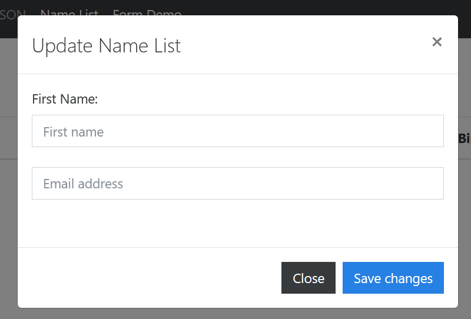
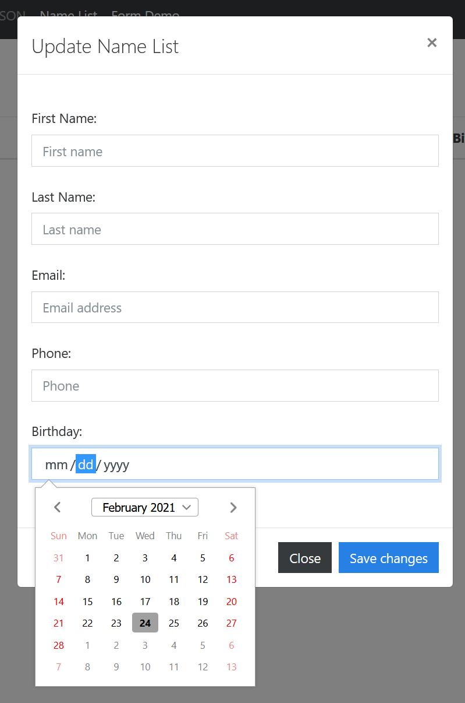
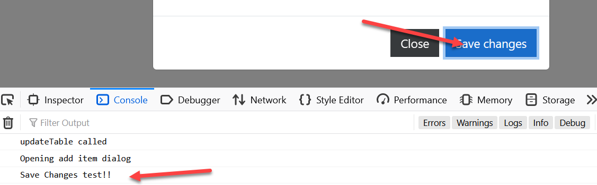
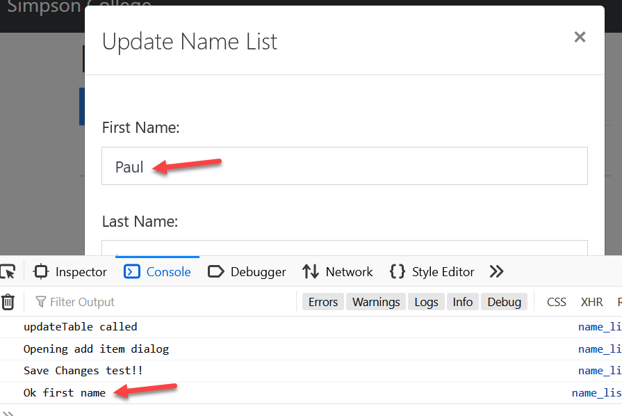
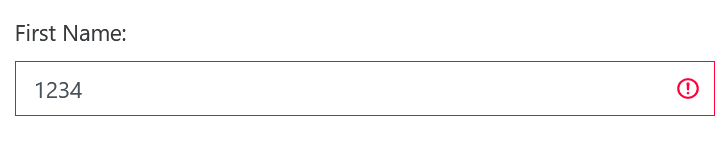

Assignment 5 - Validate a Form
==============================

Our goal with this assignment is to learn to do front-side validation of a form
using JavaScript.

This will get us ready to actually send the data to the server.

Prep
^^^^

Things have updated, so let's fix some outdated stuff in the pop-up window.
Replace in ``name_list.html`` the modal window with this new updated code:

.. code-block:: html

    <!-- This is a hidden "pop up" window that we'll use to enter new data -->
    

        

            

                

                    <!-- Window Title -->
                    <h4 class="modal-title">Update Name List</h4>
                    <!-- Close button -->
                    <button type="button" class="close" data-dismiss="modal" aria-label="Close">
                        &times;
                    </button>
                

                

                    <!-- Form -->
                    <form id="my-form" name="my-form">
                        

                            <input type="hidden" id="id" name="id" class="form-control"> 
                            <label for="firstName">First Name:</label>
                            <input type="text" id="firstName" name="firstName" class="form-control"
                                   placeholder="First name"> 
                            <input type="email" id="email" name="email" class="form-control"
                                   placeholder="Email address"> 
                        

                    </form>
                

                <!-- Footer where we put our save/close buttons -->
                

                    <button type="button" class="btn btn-secondary" data-dismiss="modal">Close</button>
                    <button id="saveChanges" type="button" class="btn btn-primary">Save changes</button>
                

            
<!-- /.modal-content -->
        
<!-- /.modal-dialog -->
    
<!-- /.modal -->

Step 1 - Get the hidden form to pop up
^^^^^^^^^^^^^^^^^^^^^^^^^^^^^^^^^^^^^^

Remember how our ``name_list.html`` file has a ``js/name_list.js`` JavaScript
file it loads? We'll be adding to that.

First, we need something to happen when we click the "Add Item" button on
the form. Let's have it call a JavaScript function:

.. code-block:: javascript

    // There's a button in the form with the ID "addItem"
    // Associate the function showDialogAdd with it.
    let addItemButton = $('#addItem');
    addItemButton.on("click", showDialogAdd);

Ok, now let's create that function. Have it pop up the hidden Bootstrap form
we have.

.. code-block:: javascript

    // Called when "Add Item" button is clicked
    function showDialogAdd() {

        // Print that we got here
        console.log("Opening add item dialog");

        // Clear out the values in the form.
        // Otherwise we'll keep values from when we last
        // opened or hit edit.
        // I'm getting it started, you can finish.
        $('#id').val("");
        $('#firstName').val("");

        // Show the hidden dialog
        $('#myModal').modal('show');
    }

Test it out. You should click on the Add Item button and see the form pop up.

Step 2 - Update form fields
^^^^^^^^^^^^^^^^^^^^^^^^^^^

Update the form to:

* Have fields for all everything
* Use labels
* Use a type of ``date`` for the birthday field, instead of ``text``.

Step 3 - Associate a function with the "Save Changes" button
^^^^^^^^^^^^^^^^^^^^^^^^^^^^^^^^^^^^^^^^^^^^^^^^^^^^^^^^^^^^

Next, in that hidden form is a button with the id of "saveChanges". Associate
a new JavaScript function called ``saveChanges`` with that button.

Have the function print something, and test it.

Step 4 - Validate the fields using regular expressions
^^^^^^^^^^^^^^^^^^^^^^^^^^^^^^^^^^^^^^^^^^^^^^^^^^^^^^

Use jQuery to grab the form fields, and then regular expressions to validate
them. Print on the console if it validates or not.
See :ref:`jquery` to remember how to validate. There's a ``validateFunction`` there.

For now, just print "Ok first name" or "Bad first name" to the console.
(Not the result field from the example, that doesn't exist here.)

Come up with reasonable regular expressions. Don't take empty fields. Don't
take fields of 35 characters if your database field is 30 characters. But you
do want to accept names like "O'Malley" and "José".

The date field will send data in a YYYY-MM-DD format, even if you enter DD/MM/YYYY.
So your regular expression will need to validate accordingly.

Step 5 - Display validation results to the user
^^^^^^^^^^^^^^^^^^^^^^^^^^^^^^^^^^^^^^^^^^^^^^^

Now we need to get the user to see what fields are ok, and what fields aren't.
Here is code that will apply the appropriate Bootstrap classes to show that
the first name field is valid:

.. code-block:: javascript

        // Set style for outline of form field
        // This is a VALID field
        $('#firstName').removeClass("is-invalid");
        $('#firstName').addClass("is-valid");

        /* etc. */

        // This is an INVALID field
        $('#firstName').removeClass("is-valid");
        $('#firstName').addClass("is-invalid");

Adjust this template for the other fields, both success and failure.

Step 6 - Clear Form
^^^^^^^^^^^^^^^^^^^

Make sure that if you close the window, and then re-open it, the form is
cleared and doesn't show green or red fields.

Tip
---

Learn how to use `AutoHotKey <https://autohotkey.com/>`_ so you don't have to
type in your form over and over.
