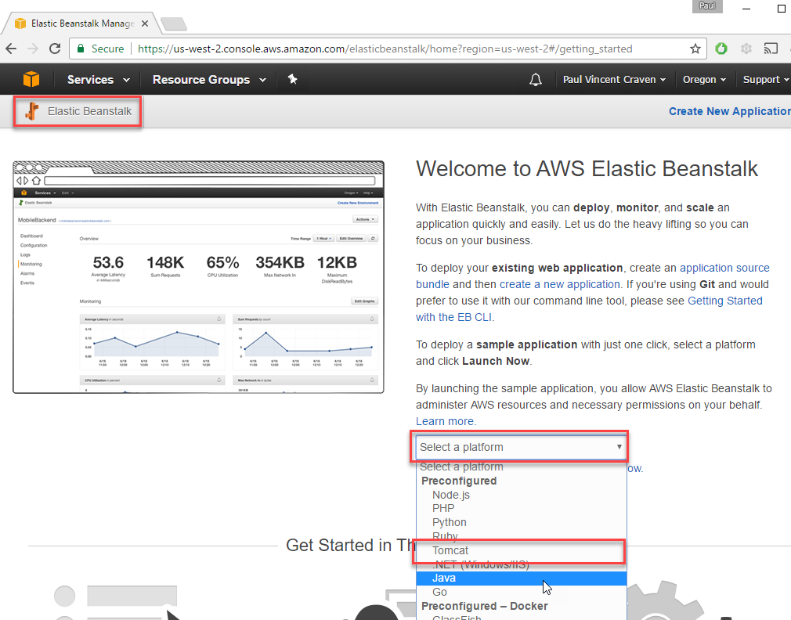
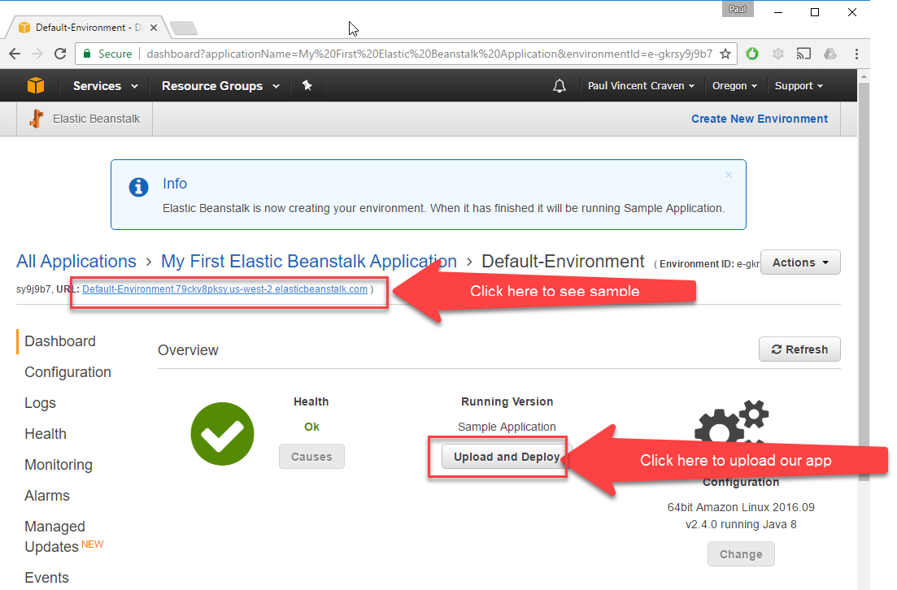
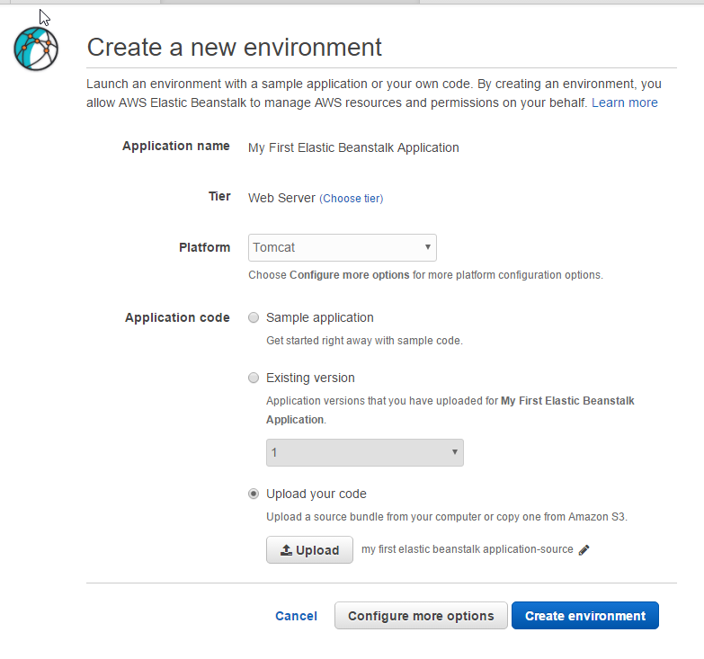
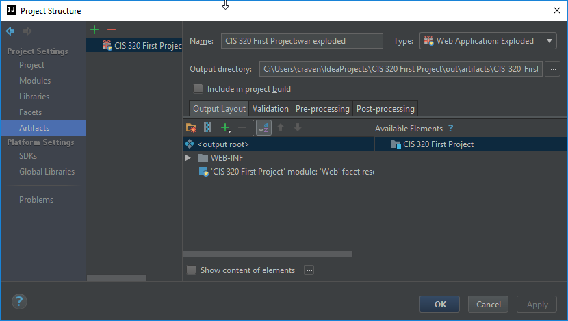
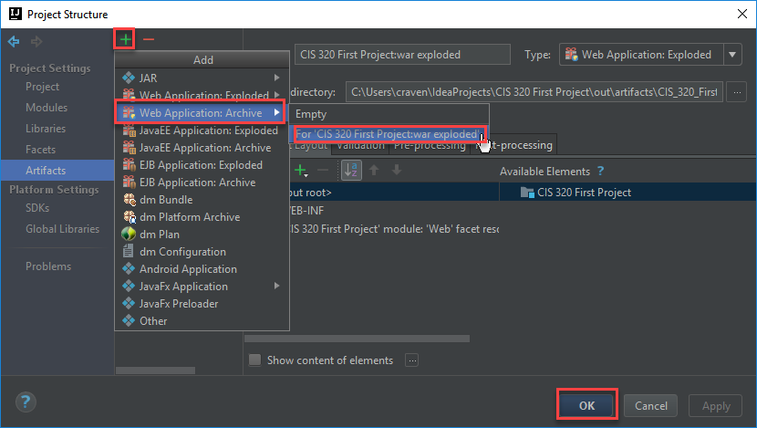
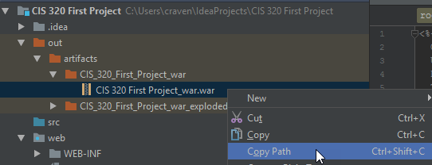
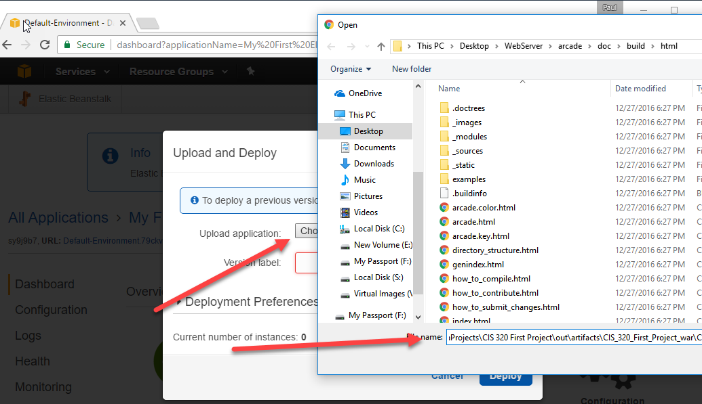

.. _java-remote-environment-tutorial:

Remote Java Servlet Development Environment Setup
=================================================

There are many ways to manage a deployment of your application to the production
environment. I could probably base an entire semester class on how to do this,
and still not cover everything.

This way of doing things seemed reasonably straight-forward to get started
with.

To begin with log into the `AWS Console`_. Then go to the "Elastic Beanstalk"
panel. Select "Tomcat." **Don't** select "Java" like I did the first time.

.. note::
  Elastic Beanstalk Service (EBS) allows you to deploy applications like servlets
  (and other types)
  to an environment that will automatically scale up or down based
  on load. Also, you don't have to maintain a full virtual machine, which is
  great.

The computer will work for a while getting the environment set up.
Next, you will see the screen shown below. AWS automatically deployed
a sample application. You can click on the URL and see it. And we have a button to
upload our application.

Since I messed up the first time while creating this tutorial, I noticed
the next time I tried to deploy an application I was given the option to update
to a new interface. I did that. It looked like this when I created the app:

Note that it is asking me to upload the application file right there, and didn't
start with a sample application.

But we haven't yet created a deployment file to upload! How do we do that? We
need to learn how to "Make WAR." This isn't a class for hippies.

Go back to IntelliJ and open up the "Project Structure" dialog. You can do
this quickly by hitting Ctrl-Alt-Shift-S. (Yes, that's four keys at once.)

Then add have IntelliJ make a WAR file:

Then select:

* Build menu
* Build Artifacts
* CIS 320 First Project:war (Do not select the exploded version. We don't want
  that kind of WAR. It doesn't explode until we hit the server.)
* At this point, it will look like nothing happened. However you should be able
  to see it in your "out" folder.
* Find the WAR file. Now we need to get on the "WAR Path." (The puns just write
  themselves!)

After that, deploy our file. Click choose file, and paste in the war path.

There you go! You should have your deployed web application. Next step will
be to start making it do something interesting.

.. _AWS Console: http://console.aws.amazon.com
