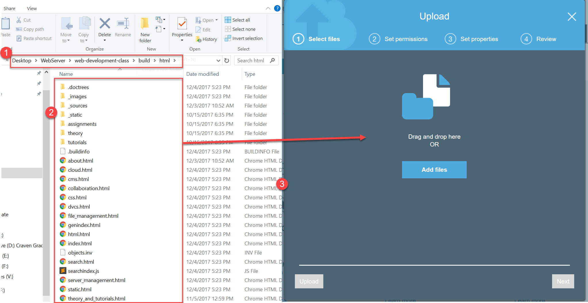

Cloud
=====

How to Create DNS Entries
-------------------------

This video shows how to create DNS record entries on AWS.

There are several
`types of DNS records <https://en.wikipedia.org/wiki/List_of_DNS_record_types>`_
available. You should know about the following:

* **SOA** - Start of Authority. This is where everything starts. Includes timers
  around the name, primary name server, and other items.
* **NS** - This is a list of all the Name Servers that can be used to look up IP
  addresses for this domain.
* **A** - This record associates a DNS name with an IP address. Or possibly multiple
  IP addresses.
* **CNAME** - This is a canonical name record. It associates this DNS entry with
  another one. Basically an "alias.

.. raw:: html

    <iframe width="420" height="315" src="https://www.youtube.com/embed/dNlibHYABLU" frameborder="0" allowfullscreen></iframe>

How to do DNS Round-Robin
-------------------------

Simple **DNS Round-Robin** entries allow you to specify multiple IP addresses
for the same DNS name. This allows you to distribute load across multiple servers.

.. raw:: html

    <iframe width="420" height="315" src="https://www.youtube.com/embed/c8T2UWu3k94" frameborder="0" allowfullscreen></iframe>

How to do Weighted DNS Round-Robin
----------------------------------

What if you have a server that is faster than the other servers? You want twice
as much traffic to go to the fast server as opposed to the slow server? No
problem! You can set up **Weighted DNS Round-Robin** lookups.

.. raw:: html

    <iframe width="420" height="315" src="https://www.youtube.com/embed/yBhCrEnj9G8" frameborder="0" allowfullscreen></iframe>

How to do Geolocation with DNS
------------------------------

What if you have customers in Europe and in the US? Where do you put your servers?
Why choose? You can put servers in both spots! Use **Geolocation DNS** to select
which DNS records to send based on the customer's location. So a client in Europe
will go to your Ireland server and a client in the US will go to your
Oregon server.

.. raw:: html

    <iframe width="420" height="315" src="https://www.youtube.com/embed/_gP8k2PkpSc" frameborder="0" allowfullscreen></iframe>

You can also create **failover** record sets, that will make only send out
DNS records for healthy servers. But since DNS entires are cached, it means
that it can take a while for a client to get a new server if one goes down.
It isn't a great way of doing fail over.

Another routing policy is based on **latency**. Latency is the time it takes to
get from the client computer to the server.
It is possible to set up servers in multiple locations, and then give out
a DNS entry for the server that has the lowest latency.

Load Balancers
--------------

Need more options for fail over and load balancing than what the DNS system
provides? Use a **load balancer**. A load balancer will actively monitor and
route traffic between servers. This video shows how to get it set up, but that's
just the tip of the iceberg when looking at what you can do with a load balancer.

.. raw:: html

    <iframe width="420" height="315" src="https://www.youtube.com/embed/DgMyvBszWUA" frameborder="0" allowfullscreen></iframe>

Monitoring Services - CloudWatch
--------------------------------

Do you need to be alerted if your server goes down? Starts using too much
CPU? The disk is too busy? Want to see if you can get buy with fewer servers?
See if you need new servers? All of this can be done with the **CloudWatch**
monitoring service.

.. raw:: html

    <iframe width="420" height="315" src="https://www.youtube.com/embed/9e6bnD37YWs" frameborder="0" allowfullscreen></iframe>

Content Delivery Network
------------------------

Do you have a lot of static files (files that don't change) that you want
to serve over the web? Like videos, or images? Use a
"**Content Delivery Network**." (CDN)

With AWS, their branded term for CDN is "**CloudFront**." Amazon also has a
service for storing files. This is the **S3** service. You can find this on
your Amazon Console.

This class's entire website is static and can be hosted over a CDN. This video
shows how it is done.

There are four steps to this process:

* Host the files on an Amazon S3 "bucket." A bucket is a simple way to upload
  and serve files without a dedicated web server. At this point, you can
  successfully get your static content, but only from one location. The content
  has not been distributed across the globe.
* Set permissions on the files so anyone can look at them.
* Associate a CloudFront instance to distribute the content in the S3 bucket.
  And then wait several minutes while everything is distributed.
* Create a CNAME record in your DNS to have a friendly URL for your content.

.. raw:: html

    <iframe width="420" height="315" src="https://www.youtube.com/embed/d_VX-ynFD6U" frameborder="0" allowfullscreen></iframe>

Hosting on S3
-------------

So, you want to host your own files that don't change often on a cloud
distributed across the globe? This is easy with AWS!

First, select Amazon's S3 service:

.. image:: s3.png
   :width: 75%

Then, select "Create Bucket":

.. image:: create_bucket.png

You need to come up with a unique bucket name that no one else has used.
Here I used ``cis-120-test``.
You can also select where you want the files served from. I'm just using
the default.

.. image:: set_bucket_name.png

Next, set the properties. These are really cool options you might want to
play around with at some point, but we don't need them for this project.

.. image:: set_options.png

We need to say who can access the buckets. This used to be hard, but now
it is rather easy. In this case, I'm saying that I can read/write to the
bucket. This is default. I don't have to change anything. (You could add
the other members of your team at this point, although I haven't had
a class try that before. If you decide to, let me know if it works.)

Then, set the bucket so that the whole world has read access. This is necessary
for our website to be public.

Then, review and create the bucket.

.. image:: review.png

Click on your bucket row (not the text) to get a screen with the properties.
If you click on the bucket text (do that now) you'll go to the overview tab.

Click the "upload" button:

.. image:: upload_button.png

Drag the files, then click "Upload"

Wait until it is done. Don't navigate away from the page, although you can
go to another tab on that page, and enable web site hosting.

(Note, there are other ways to manage these files. They can be mounted
like a network or USB drive. There are command-line tools that will
automatically synchronize them to a directory on your computer.)

Click "Properties" and enable web site hosting:

.. image:: enable_website_hosting.png

Open the link in a new tab. Ah! It is forbidden:

We have to give public access to everything in your bucket. Copy this and change
the ``cis-120-test`` to your own bucket name:

.. code-block:: JSON

   {
       "Version": "2012-10-17",
       "Statement": [
           {
               "Sid": "PublicReadGetObject",
               "Effect": "Allow",
               "Principal": "*",
               "Action": [
                   "s3:GetObject"
               ],
               "Resource": [
                   "arn:aws:s3:::cis-120-test/*"
               ]
           }
       ]
   }

Then put it in your own bucket access.

If successful, your website should work and no long be forbidden.
