Cloud Hosting Tutorial
======================

So, you want to host your own files that don't change often on a cloud
distributed across the globe? This is easy with AWS!

There are two steps you need:

* Host the files on S3
* Create a CloudFront to your S3 files

Hosting on S3
-------------

First, select Amazon's S3 service:

.. image:: s3.png
   :width: 75%

Then, select "Create Bucket":

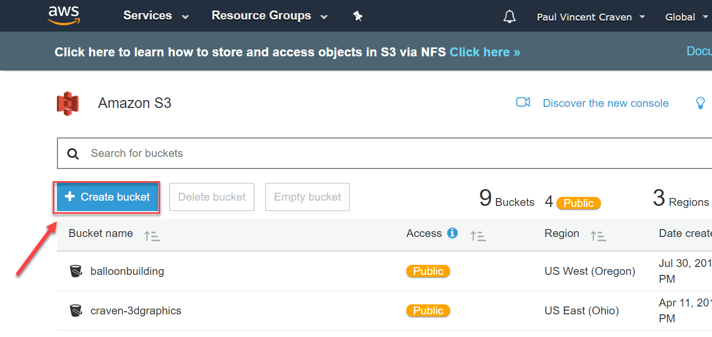

You need to come up with a unique bucket name that no one else has used.
Here I used ``cis-120-test``.
You can also select where you want the files served from. I'm just using
the default.

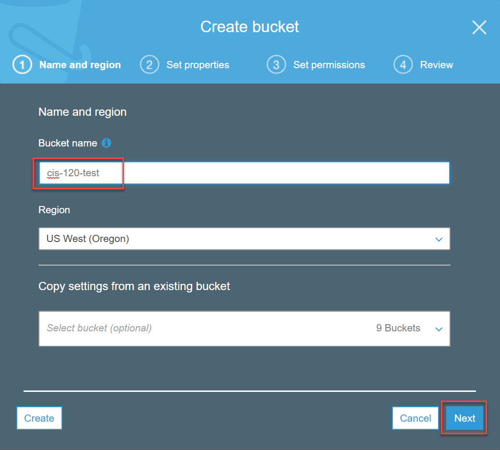

Next, set the properties. These are really cool options you might want to
play around with at some point, but we don't need them for this project.

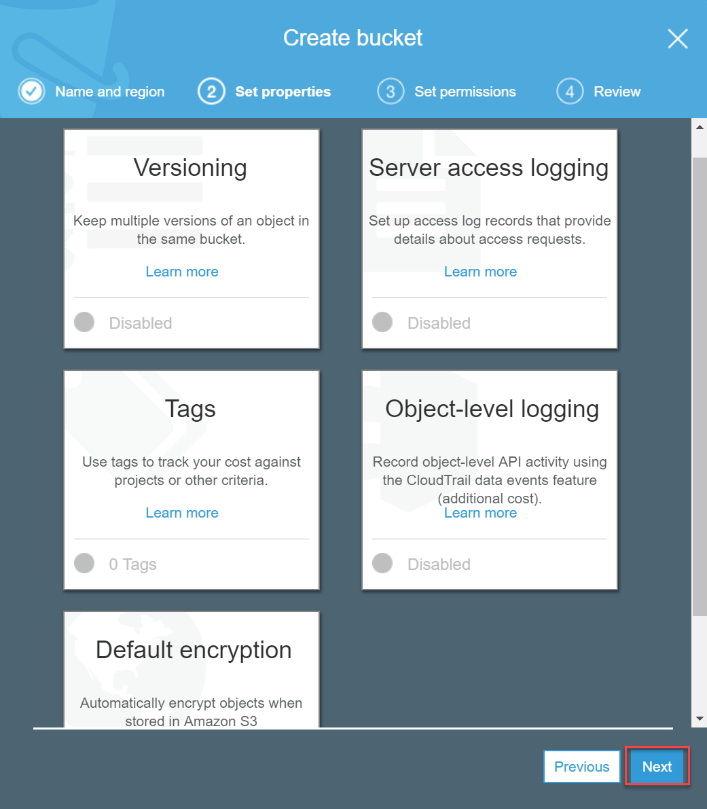

We need to say who can access the buckets. This used to be hard, but now
it is rather easy. In this case, I'm saying that I can read/write to the
bucket. This is default. I don't have to change anything. (You could add
the other members of your team at this point, although I haven't had
a class try that before. If you decide to, let me know if it works.)

Then, set the bucket so that the whole world has read access. This is necessary
for our website to be public.

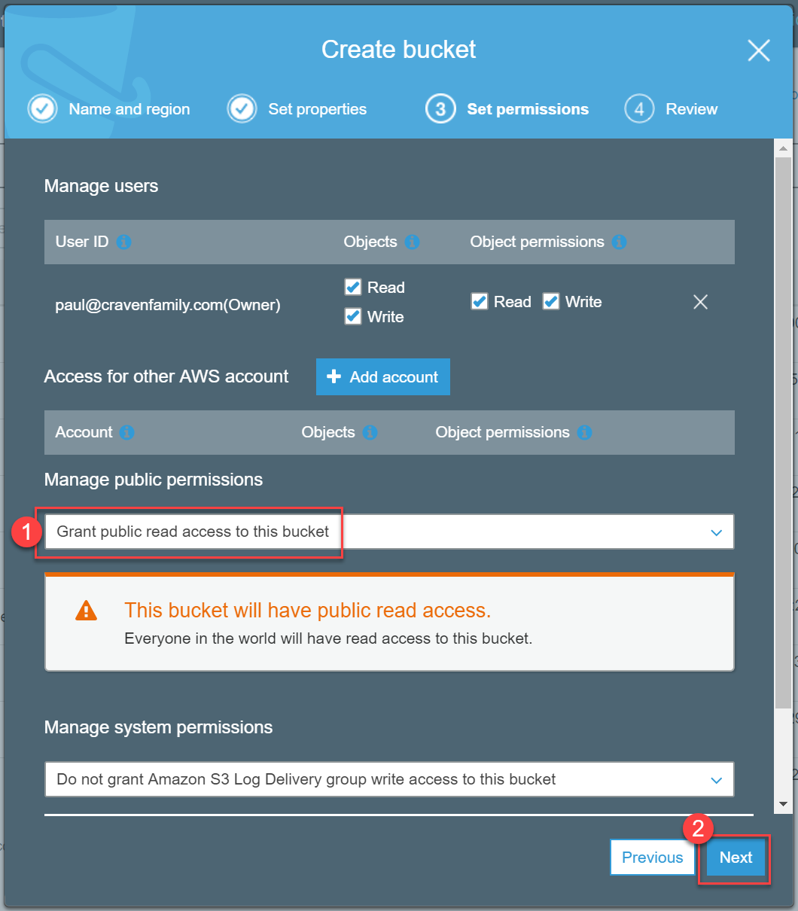

Then, review and create the bucket.

.. image:: review.png

Click on your bucket row (not the text) to get a screen with the properties.
If you click on the bucket text (do that now) you'll go to the overview tab.

.. image:: click_on_bucket.png

Click the "upload" button:

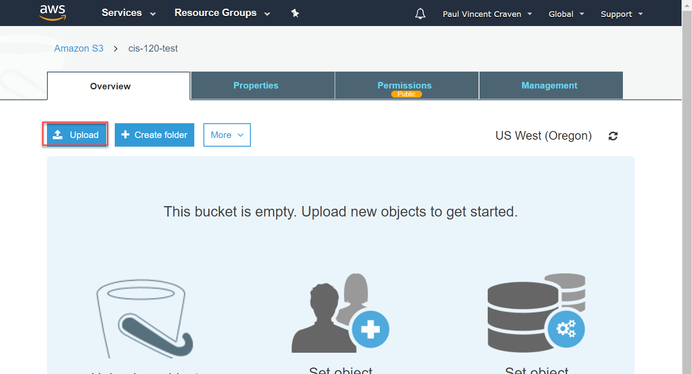

Drag the files, then click "Upload"

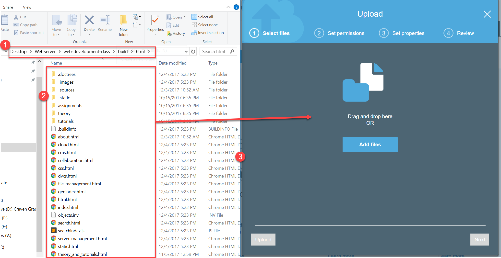

Wait until it is done. Don't navigate away from the page, although you can
go to another tab on that page, and enable web site hosting.

(Note, there are other ways to manage these files. They can be mounted
like a network or USB drive. There are command-line tools that will
automatically synchronize them to a directory on your computer.)

Click "Properties" and enable web site hosting:

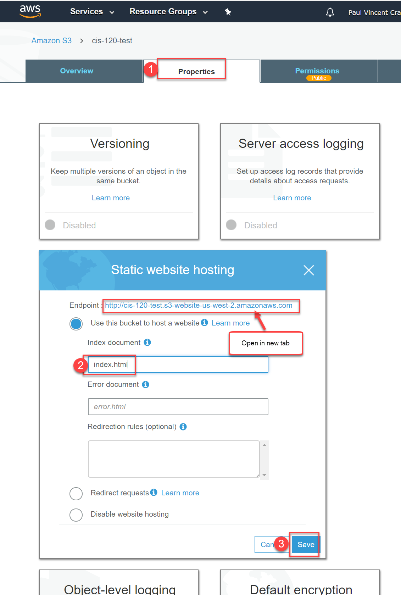

Open the link in a new tab. Ah! It is forbidden:

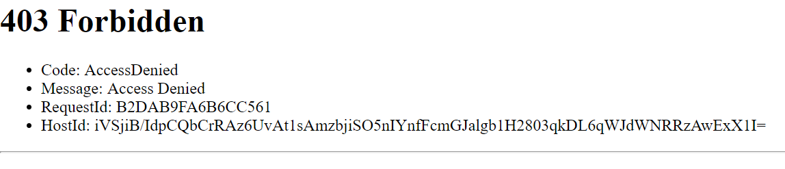

We have to give public access to everything in your bucket. Copy this and change
the ``cis-120-test`` to your own bucket name:

.. code-block:: JSON

   {
       "Version": "2012-10-17",
       "Statement": [
           {
               "Sid": "PublicReadGetObject",
               "Effect": "Allow",
               "Principal": "*",
               "Action": [
                   "s3:GetObject"
               ],
               "Resource": [
                   "arn:aws:s3:::cis-120-test/*"
               ]
           }
       ]
   }

Then put it in your own bucket access.

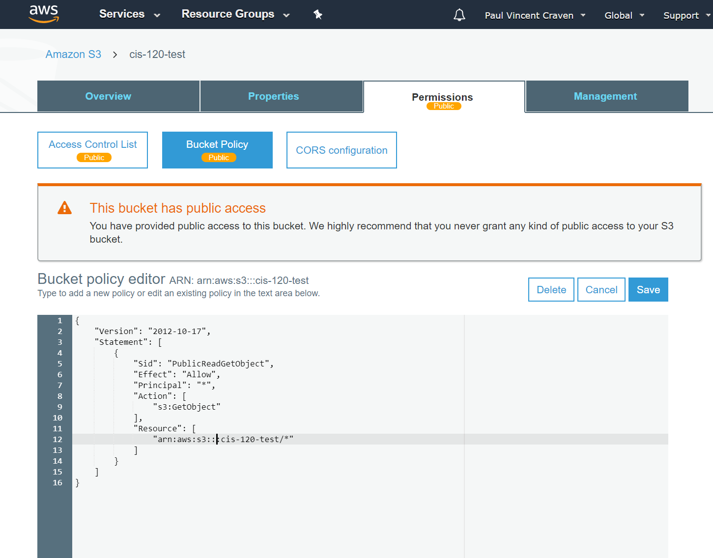

If successful, your website should work and no long be forbidden.

CloudFront
----------

Now that you have the files hosted on S3, you are part way there.
In fact, you could stop here. The advantages of doing the next
step:

* If something happens to the datacenter your S3 is in, your files
  will still be served out to people because CloudFront distributes
  across the globe.
* Your customers will likely get a server closer to them. For example,
  your Singapore customers will probably pull the files from somewhere in
  Asia, rather than Oregon.

First, select CloudFront:

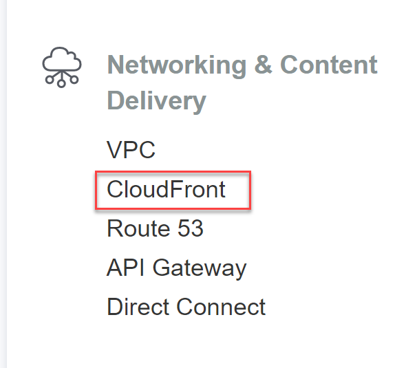

Then, hit "Create Distribution"

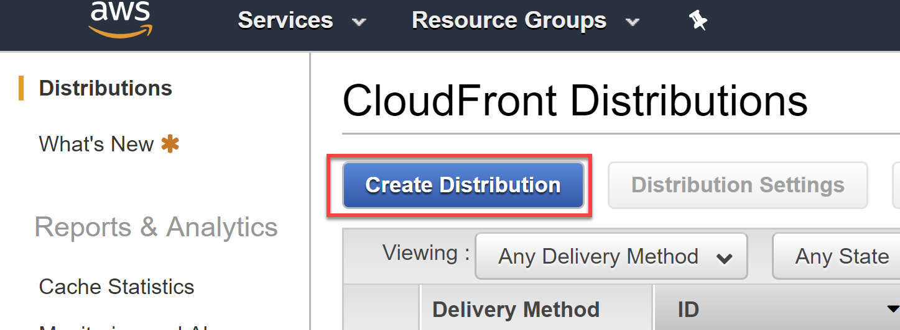

Select "Web" for your delivery method:

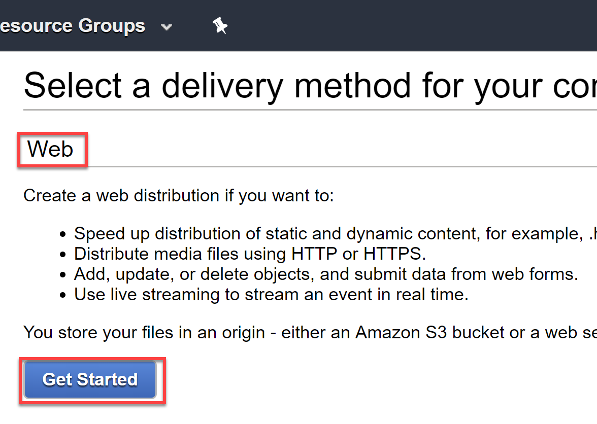

Now you need to setup the distribution options. There are a LOT of options,
but very few we need to change from the default.

We need to select our "Origin Domain Name". This is your S3 server. You might
not remember this server name. Not to worry! Just click on the field and you'll
get a pull-down of all your S3 buckets and can just select it.

The computer will fill in a default Origin ID, you can just keep that.

For "Default Root Object" you should enter "index.html"

All the other defaults are fine.

Your stuff will start getting distributed to the cloud. Go back and click on the id.

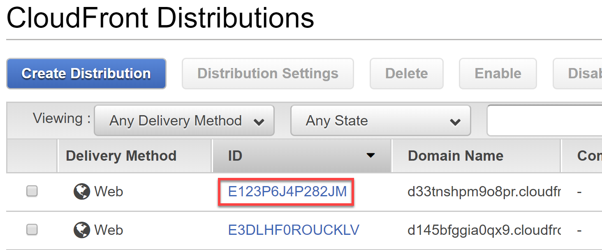

From here, you can find your CloudFront address:

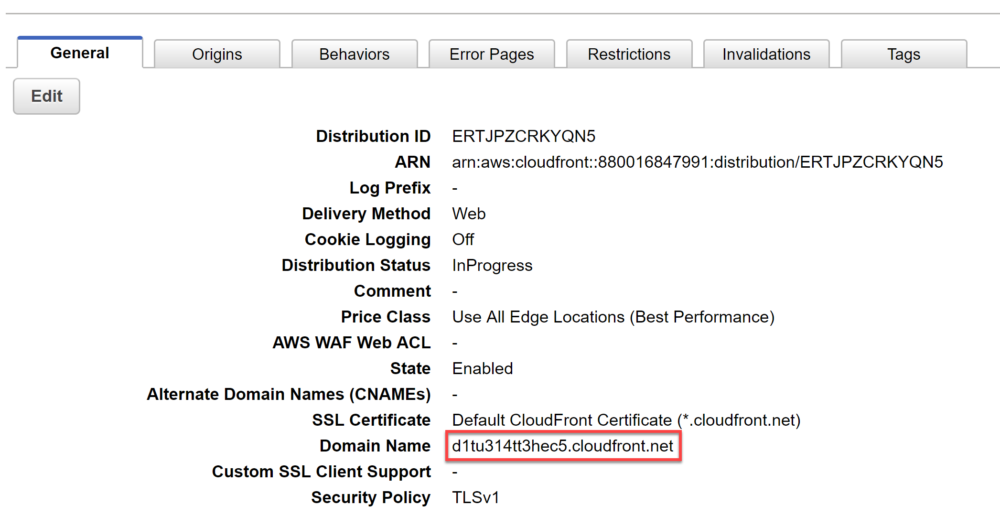

You can paste this address in a browser and see your website. (Once it is done moving it
to the cloud of course.)

If we were creating our own domains, you could now set up a CNAME fronting this cloud.
But that costs money, so we'll stop at this step.