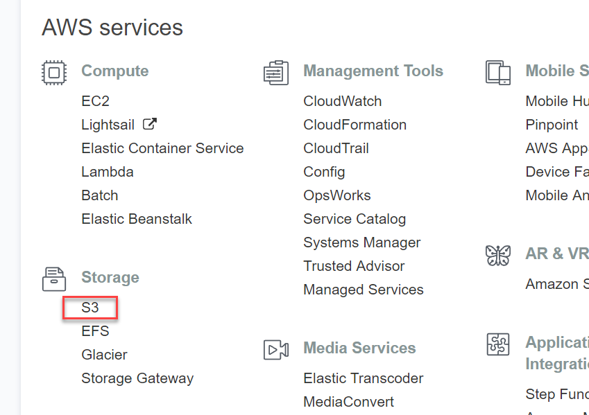

Cloud Hosting Tutorial
======================

So, you want to host your own files that don't change often on a cloud
distributed across the globe? This is easy with AWS!

Hosting on S3
-------------

First, select Amazon's S3 service:

Then, select "Create Bucket":

You need to come up with a unique bucket name that no one else has used.
Here I used ``cis-120-test``.
You can also select where you want the files served from. I'm just using
the default.

.. image:: set_bucket_name.png

Next, set the properties. These are really cool options you might want to
play around with at some point, but we don't need them for this project.

.. image:: set_options.png

We need to say who can access the buckets. This used to be hard, but now
it is rather easy. In this case, I'm saying that I can read/write to the
bucket. This is default. I don't have to change anything. (You could add
the other members of your team at this point, although I haven't had
a class try that before. If you decide to, let me know if it works.)

Then, set the bucket so that the whole world has read access. This is necessary
for our website to be public.

.. image:: set_permissions.png

Then, review and create the bucket.

.. image:: review.png

Click on your bucket row (not the text) to get a screen with the properties.
If you click on the bucket text (do that now) you'll go to the overview tab.

.. image:: click_on_bucket.png

Click the "upload" button:

Drag the files, then click "Upload"

.. image:: drag_files.png

Wait until it is done. Don't navigate away from the page, although you can
go to another tab on that page, and enable web site hosting.

(Note, there are other ways to manage these files. They can be mounted
like a network or USB drive. There are command-line tools that will
automatically synchronize them to a directory on your computer.)

Click "Properties" and enable web site hosting:

Open the link in a new tab. Ah! It is forbidden:

.. image:: forbidden.png

We have to give public access to everything in your bucket. Copy this and change
the ``cis-120-test`` to your own bucket name:

.. code-block:: JSON

   {
       "Version": "2012-10-17",
       "Statement": [
           {
               "Sid": "PublicReadGetObject",
               "Effect": "Allow",
               "Principal": "*",
               "Action": [
                   "s3:GetObject"
               ],
               "Resource": [
                   "arn:aws:s3:::cis-120-test/*"
               ]
           }
       ]
   }

Then put it in your own bucket access.

.. image:: bucket_access.png

If successful, your website should work and no long be forbidden.
