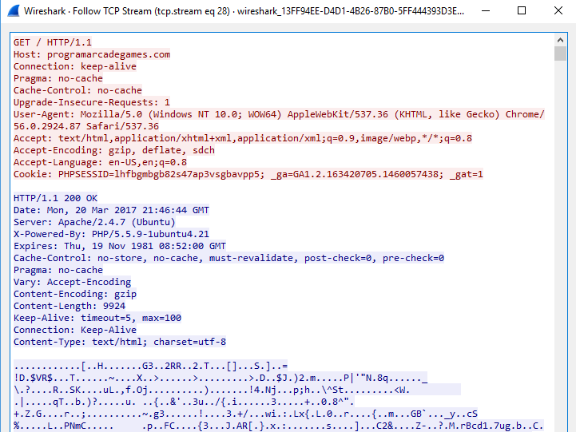
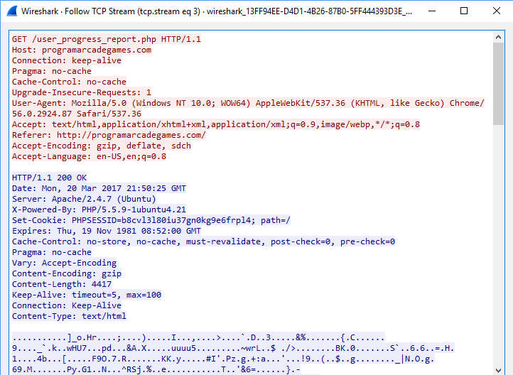

Cookies
=======

How do you look at cookies from the browser
-------------------------------------------

* Chrome: F12, find "Application" tab. Look on left side for cookies.
* Edge: F12, find "Debugger" tab. Look on left side for cookies.

How are cookies really set and transmitted?
-------------------------------------------

Cookie Demo
-----------

We want to show how to read and set cookies two different ways.

* With JavaScript on the front-end.
* With Java on the back-end.

Here's a screen shot of our end application.

.. image:: cookie_screen.png

Here is the HTML. Nothing really special here.

.. literalinclude:: cookie_demo.html
    :linenos:
    :language: html
    :caption: cookie_demo.html

You can read about getting and setting cookies more with
`W3Schools JavaScript Cookie Page <https://www.w3schools.com/js/js_cookies.asp>`_.

Here is our example JavaScript

.. literalinclude:: cookie_demo.js
    :linenos:
    :language: JavaScript
    :caption: cookie_demo.js

.. literalinclude:: GetCookiesServlet.java
    :linenos:
    :language: Java
    :caption: GetCookieServlet.java

.. literalinclude:: SetCookieServlet.java
    :linenos:
    :language: Java
    :caption: SetCookieServlet.java
