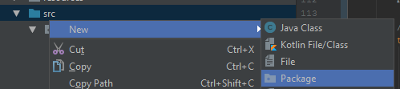
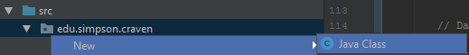
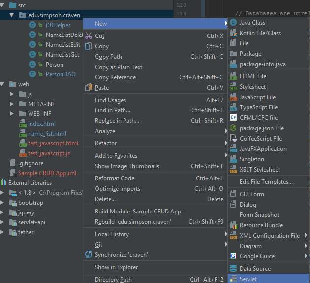

.. _manage-connections:

Managing Database Connections
=============================

Ok! How do we specify, connect, and query the database?

Overview: Usually takes three classes per table where we are doing a simple
CRUD app.

* Business Object: Simple Java class that mirrors the table. One private
  variable for each field. Getters and setters for each variable. We just
  use this to store the data. I usually match the name, so if you have "car"
  table I call this object "Car".
* Data Access Object: A class that will use SQL to access the database. I
  usually match each table with a DAO. So for the "car" table I'd create a
  class called CarDAO. Then you'd have static methods like ``getCar``,
  ``updateCar``, ``deleteCar``, etc.
* Servlet: A servlet to interface the web with your DAO. You might have one
  servlet control multiple DAO functions, or create multiple servlets, for each
  DAO function.

Specifying the DB Connection Pool
---------------------------------

Now, we need to set up the the connection. We don't want to hard-code the
connection information into our code. That would make updates too difficult, and
how would you have a different database for production, testing, and your
development? To (partially) solve this, we keep the information in a separate
text file.

In addition to the ``WEB-INF`` folder, we need a directory called
``META-INF`` stored ad the same level.
Connection information is stored in
a file called ``META-INF/context.xml``.

Here is an example of what it should look like. Update as needed.

.. code-block:: xml

    <?xml version="1.0" encoding="UTF-8"?>
    <Context>
        <Resource name="jdbc/cis320"
                  auth="Container"
                  type="javax.sql.DataSource"
                  username="cis320"
                  password="mysecretpassword"
                  driverClassName="com.mysql.jdbc.Driver"
                  url="jdbc:mysql://cis320c.cp6n5ccfdx2q.us-west-2.rds.amazonaws.com:3306/cis320"
                  maxActive="15"
                  maxIdle="3"/>
    </Context>

Tomcat has built in classes to manage a `connection pool`_. It takes a long
time to build a connection, so we reuse connections to the database between web
requests. Tomcat looks for this specific file in this specific directory
when it starts up. If it exists, it will read
``context.xml`` file and set up that pool.

.. _connection pool: https://en.wikipedia.org/wiki/Connection_pool

Connecting to the Database
--------------------------

The basic code to create a database connection in Java, using a connection pool,
looks like this.

.. code-block:: java

    import java.sql.Connection;
    import javax.sql.DataSource;
    import javax.naming.Context;
    import javax.naming.InitialContext;

    // .. etc ..

    // Create a context. Uses context.xml
    Context initContext = new InitialContext();

    // Select which context to lookup.
    Context envContext = (Context) initContext.lookup("java:/comp/env");

    // Grab a source of database connection. Note how this matches the name
    // field in context.xml.
    DataSource ds = (DataSource) envContext.lookup("jdbc/cis320");

    // Hey, now we've got a datasource for connections. Let's get a connection.
    Connection conn = ds.getConnection();

I hate putting in all that code when I want a database connection. Plus what if
I change a name? I don't want to go through my entire program replacing
"jdbc/cis320" with something new. So I typically put this in a helper class
that looks like:

.. literalinclude:: DBHelper.java
    :linenos:
    :language: java

Then in the code I can just do:

.. code-block:: java

    conn = DBHelper.getConnection();

Querying the Database
---------------------

Typically, I created a "Data Access Object". Static methods for each action
(Static - no need to create an instance of the object.) For example, here
is a function that gets a list of people:

.. code-block:: java

    /**
     * Get a list of the people in the database.
     * @return Returns a list of instances of the People class.
     */
    public static List<Person> getPeople() {
        log.log(Level.FINE, "Get people");

        // Create an empty linked list to put the people we get from the database into.
        List<Person> list = new LinkedList<Person>();

        // Declare our variables
        Connection conn = null;
        PreparedStatement stmt = null;
        ResultSet rs = null;

        // Databases are unreliable. Use some exception handling
        try {
            // Get our database connection
            conn = DBHelper.getConnection();

            // This is a string that is our SQL query.
            String sql = "select id, first, last from person";

            // If you had parameters, it would look something like
            // String sql = "select id, first, last, phone from person where id = ?";

            // Create an object with all the info about our SQL statement to run.
            stmt = conn.prepareStatement(sql);

            // If you had parameters, they would be set wit something like:
            // stmt.setString(1, "1");

            // Execute the SQL and get the results
            rs = stmt.executeQuery();

            // Loop through each record
            while(rs.next()) {
                // Create a new instance of the Person object.
                // You'll need to define that somewhere. Just a simple class with getters and setters on the
                // fields.
                Person person = new Person();

                // Get the data from the result set, and copy it to the Person object
                person.setId(rs.getInt("id"));
                person.setFirst(rs.getString("first"));
                person.setLast(rs.getString("last"));

                // Add this person to the list so we can return it.
                list.add(person);
            }
        } catch (SQLException se) {
            log.log(Level.SEVERE, "SQL Error", se );
        } catch (Exception e) {
            log.log(Level.SEVERE, "Error", e );
        } finally {
            // Ok, close our result set, statement, and connection
            try { rs.close(); } catch (Exception e) { log.log(Level.SEVERE, "Error", e ); }
            try { stmt.close(); } catch (Exception e) { log.log(Level.SEVERE, "Error", e ); }
            try { conn.close(); } catch (Exception e) { log.log(Level.SEVERE, "Error", e ); }
        }
        // Done! Return the results
        return list;
    }

Writing the Servlet
-------------------

Here's a code sample for a servlet that chucks the list of people out over
JSON. I only print firstName and id, the other fields you can fill in:

.. code-block:: java

    @WebServlet(name = "NameListGet")
    public class NameListGet extends HttpServlet {
        protected void doGet(HttpServletRequest request, HttpServletResponse response) throws ServletException, IOException {

            // Set the output type, and get the output stream
            response.setContentType("application/json");
            PrintWriter out = response.getWriter();

            // Use the DAO to get a list of people
            List <Person> peopleList = PersonDAO.getPeople();

            // Start the JSON output. We'll have an array of people, so start with a "[" which signifies an array
            out.print("[");

            // Keep a boolean so we can figure out where to put the stupid commas.
            boolean start = false;

            // Loop through each person in the list.
            for (Person person : peopleList) {

                // Here we need to figure out if we should print a comma
                if (!start) {
                    start = true;
                    out.println();
                } else
                    out.println(",");

                // Start printing out field, name combinations.
                out.print("{\"id\" : ");
                out.print("\"");
                out.print(person.getId());
                out.print("\",");

                out.print("\"firstName\" : ");
                out.print("\"");
                out.print(person.getFirst());
                out.print("\"");

                out.print("}");
            }
            out.println("\r\n]");
        }
    }

Setting Up The Project
----------------------

Ok! You want to create these classes. How?

Creating a Package
^^^^^^^^^^^^^^^^^^

To start with, we normally put Java files into a package. Yes, Java
doesn't *force* you to put classes in a package.
With smaller assignments there isn't a reason to. But there's nothing small
about web development, so we need to use packages.

All our source goes into the ``src`` folder. So right-click on the ``src``
folder and create a new package.

Packages normally have a broad-to-specific format. Here are a couple examples:

* ``edu.simpson.computerscience.datastructures.linkedlistproject``
* ``com.wellsfargo.mortgage.coreproject.userinterface``

Get the idea? This will define a folder structure for our files. So class files
have to go in the following directories:

* ``edu/simpson/computerscience/datastructures/linkedlistproject``
* ``com/wellsfargo/mortgage/coreproject/userinterface``

Simple and effective. When you create a package, you are just creating a
set of directories.

Creating a Class
^^^^^^^^^^^^^^^^

Once you have a package, create a new Java class. Right-click on the package
and select a new Java class.

If your class is called ``DBHelper``, then it *must* go into a file called
``DBHelper.java``. If you rename the class, you have to rename the file.

Furthermore, if ``DBHelper`` is in a package called
``edu.simpson.computerscience.webdevelopment`` it must be stored in a
directory path of:
``edu/simpson/computerscience/webdevelopment``.

Creating a Servlet
^^^^^^^^^^^^^^^^^^

Ok, we can create servlets the same way:

You will also need to map the servlet to a URL. This maps
``edu.simpson.webdevelopment.NameListGet`` to
``/api/name_list_get``.

.. code-block:: xml

    <?xml version="1.0" encoding="UTF-8"?>
    <web-app xmlns="http://xmlns.jcp.org/xml/ns/javaee"
             xmlns:xsi="http://www.w3.org/2001/XMLSchema-instance"
             xsi:schemaLocation="http://xmlns.jcp.org/xml/ns/javaee http://xmlns.jcp.org/xml/ns/javaee/web-app_3_1.xsd"
             version="3.1">

        <servlet>
            <servlet-name>NameListGet</servlet-name>
            <servlet-class>edu.simpson.webdevelopment.NameListGet</servlet-class>
        </servlet>

        <servlet-mapping>
            <servlet-name>NameListGet</servlet-name>
            <url-pattern>/api/name_list_get</url-pattern>
        </servlet-mapping>

    </web-app>

The servlet itself will look like:

.. code-block:: Java

    package edu.simpson.craven;

    import javax.servlet.ServletException;
    import javax.servlet.annotation.WebServlet;
    import javax.servlet.http.HttpServlet;
    import javax.servlet.http.HttpServletRequest;
    import javax.servlet.http.HttpServletResponse;
    import java.io.IOException;
    import java.io.PrintWriter;
    import java.util.List;

    @WebServlet(name = "NameListGet")
    public class NameListGet extends HttpServlet {

        protected void doGet(HttpServletRequest request, HttpServletResponse response) throws ServletException, IOException {

            response.setContentType("application/json");
            PrintWriter out = response.getWriter();

            // Replace the line below with your database code that will
            // write out your JSON file.
            out.print("{ \"Field\":\"Value\"}");

        }
    }

Creating a JSON object manually can be a pain. Particularly with putting
the commas in the right spot. You can use the `Google GSON library` to do it for
you. I have a link to download the 'jar' file at the top of our Scholar website.
Put the 'jar' file in the ``WEB-INF/lib`` folder for it to work.

.. _Google GSON library: https://github.com/google/gson

.. code-block:: Java

   import com.google.gson.Gson;

   // Blah, blah

   Gson gson = new Gson();

   // serializes target to Json
   String json = gson.toJson(myObject);
