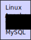

Stacks
======

A lot of development you may have done so far was simple when it came time to
select tools. When you started a project, the biggest consideration was, "What
language will I use?"
That is, if you even got to pick the language. (Evil professors might choose for
you.)

With mature technologies, there are commonly accepted ways of doing things. This
is not case when developing for the web.
What we have is a seven-course buffet of
items to choose from. Some of these items go together well. Some don't.

With a buffet, if you find a bad pairing of food, you just get over it
and go on to your next meal. If you make a bad pick of web development
tools you may be stuck for
years with that setup. In fact, the only way to get away from those tool choices
could be to take a job elsewhere. Or more likely, you'll get a new job and be stuck with
someone else's buffet selections. And some of your tools will no longer
be supported. So you have millions of dollars of development and a business
that relies on tools that aren't being updated.
Ok, no pressure when selecting tools, right?

We call these tool choices **stacks**. Here are some of the things that go into
a stack, along with examples of what choices you might have:

* Operating System - Linux, Windows, Mac
* Web server - Apache, Internet Information Server (IIS)
* Application server / programming language
* Database - MySQL, MS SQL Server, Oracle DB, IBM DB2
* Language frameworks - Hibernate
* Front-end frameworks - AngularJS, jQuery, React, D3
* Build environment - Maven, Git, SourceTree, GitHub

Some stacks have fancy names. Like **LAMP** stands for Linux, Apache, MySQL,
and PHP.

Operating System
----------------

Plain Operating Systems
^^^^^^^^^^^^^^^^^^^^^^^

If you are lucky, your stack might be operating system independent. It is not
unusual for developers to write using MS Windows, then deploy onto a Linux
machine.

Linux is a popular choice for serving files. There is no need to pay Microsoft
for Windows licenses, which reduces server cost. The operating system doesn't
have run a Window environment (although it can) which reduces memory, CPU, and
disk requirements for the server. Linux servers can be rather easy to administer
remotely. They are also easy to script, allowing fast setup of new servers.
For example, just using one ``apt-get`` command can install all the needed
software on a new server. That's not easy to do with Windows!

Mac is based on the UNIX operating system, so it is similar to Linux
servers in administration. But rarely do people use Macs as servers. It is
expensive and the company is focused on creating a great user experience, not a
great server experience. However their laptops are so popular many developers
like to use Macs, particularly if they deploy onto Linux operating systems.

Windows is popular. So using it as a server is also popular. If you
are using Microsoft tools for development, then having your whole stack controlled
by Microsoft can be great when you need support. There is no other company for
Microsoft to point its finger at when something goes wrong with the stack.

Virtual Machines
^^^^^^^^^^^^^^^^

What if you work on two projects? One requires Linux, and one requires Windows?
Or one requires Tomcat, and one requires Microsoft .NET? Or even worse, what if
one requires Tomcat 8, and one requires Tomcat 9?

Installing a lot of different toolkits on your computer can lead to "pollution"
where you have too much junk installed. And you aren't sure if you still use it.
Plus, what if something works on your computer, but not another person's computer?\
Why? Which of the 250 different software packages allow it to run? And what if
there is software that doesn't let you install version 8 and 9 at the same time,
but you have project that depend on both?

A solution for this is to use a `virtual machine`_ (VM). We using software that
*pretends* to be a computer. So we run a pretend computer on a real computer.
Then we can start up a Linux machine on a Windows machine. We can have multiple
Window computers, each with a different configuration.

Oracle VirtualBox_ is a free software program that lets you run VMs. It is a great
way to play around with Linux if you want, and not have to mess up your computer.

.. _virtual machine: https://en.wikipedia.org/wiki/Virtual_machine
.. _VirtualBox: https://www.virtualbox.org/

Docker
^^^^^^

Virtual Machines have disadvantages. They are resource-hungry.
The use acres of disk space and oodles of memory.
If you want to run
two Windows VMs on a Windows computer, you need three times the memory and disk
space that a normal computer would have. And making copies of a virtual machine
takes ages, because you are copying gigabytes, as you basically recreate the virtual
hard drive of the VM.

There needs to be a middle-ground. Where you could create a VM based off a Linux
VM and then have one with an application server installed, and other with a
database installed. But both share the same operating system install. Where it
there is an ecosystem of common configurations to download and use. Where it takes
less than a second to create a copy of a machine.

And there is. Welcome to Docker_. The idea is that rather than a full VM, we have
"shipping containers" which are smaller mid-sized units with common interfaces
that we can put on a "container ship."

.. raw:: html

	<iframe width="560" height="315" src="https://www.youtube.com/embed/Q5POuMHxW-0" frameborder="0" allowfullscreen></iframe>

.. _Docker: https://www.docker.com/

Web Application Servers
-----------------------

`application server`_
Popular types of application servers:

* Java-based servers such as Tomcat_, JBoss, Glassfish, Geronimo, WebLogic, WebSphere
* .NET based servers from Microsoft, or Mono
* PHP
* Python such as Django_
* JavaScript - Node.js

.. _application server: https://en.wikipedia.org/wiki/Application_server
.. _Tomcat: http://tomcat.apache.org/
.. _Django: https://www.djangoproject.com/

Tomcat
^^^^^^

* Talk about tomcat
* Talk about pure servlet vs. JSP.
* Talk about Apache vs. Tomcat
