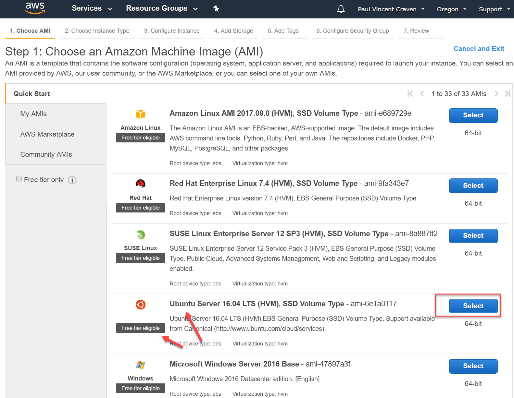
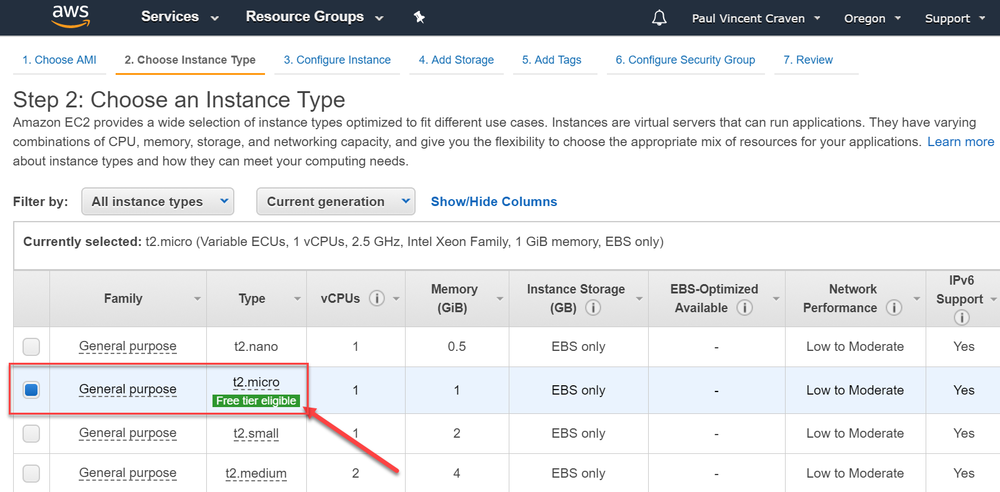

.. _aws_setup:

Amazon Web Services
===================

This chapter covers how to get a public web server up and running using
Amazon Web Services (AWS).
We also connect the web server to our GitHub account so that it will
automatically update with the code that we push to GitHub.

Adding the Deploy Script
------------------------

* Start with a project that you already have worked on. Probably your last
  assignment.
* You will want your own copy of the project. (If the project is currently
  under your account, you can skip this step.) Go to the project and create a
  "fork":

.. image:: fork.png
    :width: 600px
    :align: center

* At this point, you have a copy of the project under your name.
  You will need to "clone" the new fork that you created. Clone it into a
  new empty folder. Do not clone it into your copy of the original project.
* Use SourceTree to select the branch that you want to work on.
* We will assume you have a directory structure created something like the image
  below. If not, adjust it now. The most common issue I've run into would be
  people who have a ``public html`` folder instead of a ``public_html`` folder.
  No spaces!

.. image:: sample_directory_structure.png
    :width: 300px
    :align: center

* Create a new file in the public_html named ``deploy_script.php``.
* Paste into ``deploy_script.php`` the following code listing.
  This page, when accessed, will go to GitHub and update our website.

.. literalinclude:: deploy_script.php
    :linenos:
    :language: php

You don't need to know how the code above works, but if you are curious,
here is the explanation.

The command ``shell_exec`` will run a command at the
operating system level. That is, it will be like if we typed in a command
at the command prompt. But instead of us, it will be the web page that does
the command entry.

We can chain several of these commands together by separating
them with semi-colons.

The command uses ``git`` to pull the
changes, and then update the files with the changes. The ``2>&1`` redirects both
the standard output (stdout) and the error (stderr) to be captured into the
$output variable. If you aren't familiar with standard input and output
streams, check out the
`Wikipedia article <http://en.wikipedia.org/wiki/Standard_streams>`_ on
the subject.

We will eventually set GitHub up to call this web page when we push new code to
the repository. For now, just create the file and add it to GitHub.

.. attention::
    Make sure your are on the proper branch. Add the file. Commit. Push.

Create a Server Instance
------------------------

If you are being provide a server instance by your instructor, skip to the
`Setting Up The Server`_ section.

Sign up for a Amazon Web Services account, and access the AWS console at:

https://console.aws.amazon.com

Select EC2:

.. image:: select_ec2.png
    :width: 640px
    :align: center

Launch a new instance:

.. image:: launch_instance_1.png
    :width: 550px
    :align: center

Select Ubuntu:

Use a small, free machine:

The instance details defaults are ok, so click "Review and Launch":

.. image:: instance_details.png
    :width: 640px
    :align: center

We need security. Hit "Edit Security Groups":

.. image:: edit_security_groups.png
    :width: 550px
    :align: center

Computers use numbered "ports" to sort web traffic. That way they can keep
web traffic separate from e-mail, file sharing, etc.

We want everyone to connect to our web server to get web pages. "HTTP"
controls normal un-encrypted web page requests. It runs on port 80.

HTTPS controls encrypted web traffic. It runs on port 443.

SSH allows us to "shell" over to the machine and type in commands. That runs on
port 22.

For proper security, we want anyone to connect to our server via HTTP and HTTPS.
We only want our own computer to connect via SSH, because that's what we use
to administrate our accounts.

Set up the security groups as shown. Your "My IP" will fill in automatically
with your IP address when the drop-down box is selected. You'll need to add a
SSH row for each computer IP you want to shell in from.

Hit "Launch" again:

.. image:: launch_instance_2.png
    :width: 600px
    :align: center

Still isn't launching. We need a private/public key pair. We'll use this
instead of a password. It is more secure. Name your key pair. Download it.
Save it somewhere safe. You can't download it again, so if you lose that
file you lose access to your servers. You can use the same key/pair for
many servers if you want.

.. attention::
    **Do not save your PEM key into the HTML folder or allow it to be
    checked into version control.**

Seriously. Make sure you didn't save this in the same folder as all your web stuff.
Do not risk it being checked into version control. Go make sure. I'll wait.

Did you make sure?

.. danger::

    **Really, DO NOT ALLOW THIS FILE INTO VERSION CONTROL.**

If you do this, you are giving everyone access to all your stuff. Also,
version control keeps old versions. Deleting it won't remove the file.
And once it hits GitHub every evil person will have it.
You'll need to recreate your key.

*Do* save the key somewhere safe. On a flash drive or network drive. If you
lose the key file, you can't access your machine and you'll have to start over.

.. image:: download_keypair.png
    :width: 600px
    :align: center

Now will it launch? Because this will be the third time we've hit "Launch."

.. image:: launch_instance_3.png
    :width: 600px
    :align: center

Yay! We've launched our server. Click the link shown (you'll have a different
id) to see your server's status.

.. image:: view_instance.png
    :width: 600px
    :align: center

The server is starting up. if you look under "Status Checks" column, you'll
see it start with "Initializing" and eventually say something like
"2/2 checks passed."

Setting Up The Server
---------------------

Getting to the Server
^^^^^^^^^^^^^^^^^^^^^

Copy the Public DNS address we get from Amazon, or that you got from your
instructor if he set up the server for you.

.. image:: copy_address.png
    :width: 600px
    :align: center

Use that address and the key to get a command shell on the new server. I'm
using MobaXTerm for access, you could also use PuTTY, or the "Terminal" on
the Mac. I'm not sure how to get the Mac to work off-hand.

.. image:: moba_1.png
    :width: 600px
    :align: center

Enter in the info needed to get access. The user name will always be
"ubuntu", but your address and where you stored the key/pair will be different.

.. image:: moba_2.png
    :width: 600px
    :align: center

Installing and Updating the Software
^^^^^^^^^^^^^^^^^^^^^^^^^^^^^^^^^^^^

We are now in the server. We need to update the software. Enter these commands.
You can copy/paste them if you like. Note that most terminal programs use
shift-insert to paste, and not ctrl-v. Copy the commands one line at a time.

::

  sudo apt-get update

  # For the next two, if you are asked questions during the update/install, just hit 'enter' for the default
  sudo apt-get -y upgrade
  sudo apt-get -y install apache2 git php7.0 libapache2-mod-php7.0

The first line checks for software updates. The second line installs them.
The third line installs those four new programs that we will need for our webserver.

In detail, here's what the commands mean:

* Line 1:
    * ``sudo`` means "Substitute User Do". It allows us to run the next command
      as someone else. It defaults to the root (administrator).
    * ``apt-get`` is the software manager.
    * ``update`` is a apt-get directive that tells apt-get to go check for
      updated software. It doesn't update it, it just checks for updates.
* Line 2:
    * ``apt-get`` is the software manager.
    * ``-y`` tells apt-get that the answer is "yes" to any questions it asks.
    * upgrade downloads any updated software we found in the prior step.
      Normally it would list out all the software packages and ask, but we
      already told it yes with the -y.
* Line 3:
    * ``install`` directive for apt-get asks to install new software. There are
      four software packages listed. ``apache2`` is the web server, ``php5`` is the
      application server, ``php5-mysql`` allows us to hook the application server
      to the database, and ``git`` is our version control software.

Check the Web Server
^^^^^^^^^^^^^^^^^^^^

Check to see if your web server is running by going to the DNS name of the
server. You should get a default page.

.. image:: default_web_page.png
    :width: 600px
    :align: center

Installing an Encryption Key
----------------------------

Next, we need a key/pair to handle the connection between our server and GitHub.
Use these commands on the terminal, updating the e-mail address to your own.
When it asks for a pass-phrase, just hit "enter."

In detail, here's how the commands break down:

* Line 1: ``cd`` is the "change directory" command. By the file system hierarchy
  default, all the web stuff on most Linux machines will be stored in ``/var/www``.
* Line 2: ``mkdir`` makes a directory. The ``.ssh`` directory is where a users
  public/private keys are stored. In the case of the apache process, the home
  directory is ``/var/www`` so we put the ``.ssh`` folder here.
* Line 3: ``chown`` changes the ownership of a file. Because we created .ssh as
  root, we need to change it to the owner of the apache process which is
  ``www-data``. We are changing both the user and the group, so that is why
  there is a colon and the user name twice.
* Line 9: The ``sudo -u www-data`` tells the computer to run the next command as
  the www-data user. This is the user that Apache runs under. We want to create
  the key as the user Apache runs under, otherwise Apache won't be able to
  access it. The command ``ssh-keygen -t rsa -C "your.email@simpson.edu"``
  generates an RSA key/pair. By default they will be stored in the users ``.ssh``
  folder, which in this case is ``/var/.ssh``.
* Line 10: ``ssh-agent -s`` starts a background process that manages the keys.
* Line 11: The cat command prints the contents of a file to the screen. We will
  pass the contents of the id_rsa file to GitHub to finish the connection.

.. code-block:: bash
    :linenos:

    cd /var/www
    sudo mkdir .ssh
    sudo chown -R www-data:www-data .ssh

    # Stop! Enter this next line (below) by itself.
    # It will ask three questions. Hit 'enter' for
    # each one. Don't keep pasting the other lines
    # in for each question. You can update with your
    # e-mail but it isn't necessary.
    sudo -u www-data ssh-keygen -t rsa -C "your.email@simpson.edu"

    sudo -u www-data ssh-agent -s
    cat .ssh/id_rsa.pub

The last command will output your key to the screen. Highlight it. Copy it using
ctrl-insert instead of ctrl-c. Don't save this key in your version control either!

.. image:: copy_key.png
    :width: 640px
    :align: center

Go back to GitHub and add it as a deployment key. Select your profile:

.. image:: select_github_profile.png
    :width: 200px
    :align: center

Edit your profile:

.. image:: edit_github_profile.png
    :width: 200px
    :align: center

Add in the key:

.. image:: add_github_key.png
    :width: 600px
    :align: center

Clone the Repository
--------------------

Now we need to get the code set up. Enter the commands below. Replace
sample-web-project with the name of your GitHub project. Replace pvcraven with
your own GitHub id. After you enter line four it will give you a warning
about adding a key, answer "yes" to that warning.

.. attention::
    Don't blindly copy/paste. Don't use "sample-web-project", use the name of your project as it
    exists on the GitHub URL. There are **three** places you need to do so in the script
    below. Also, replace ``the_brach_i_want`` with the branch that you want to be shown.

::

  cd /var/www

  # Update the next line with the name of your project, as shown in your
  # GitHub's URL.
  sudo mkdir sample-web-project
  sudo chown -R www-data:www-data sample-web-project

  # Update the next line with your GitHub id and GitHub project name.
  # You will likely be asked a yes/no question. Go ahead and say 'yes'
  sudo -u www-data git clone git@github.com:pvcraven/sample-web-project.git
  sudo -u www-data git checkout the_branch_i_want

Point Apache Web Server to Our Files
------------------------------------

::

  cd /etc/apache2/sites-available

  # Use the 'nano' editor to edit this file
  sudo nano 000-default.conf

Update the file's ``DocumentRoot`` to point to the directory that holds your
web site. See the highlighted line below that you should edit:

.. attention::

    Don't use the mouse in nano. Use the arrow keys on your keyboard to move around.
    To exit out of the "nano" editor, hit "ctrl-x", hit "yes" to save, and then "enter"
    to save as the same file name.

.. code-block:: text
    :linenos:
    :emphasize-lines: 12

    <VirtualHost *:80>
            # The ServerName directive sets the request scheme, hostname and port that
            # the server uses to identify itself. This is used when creating
            # redirection URLs. In the context of virtual hosts, the ServerName
            # specifies what hostname must appear in the request's Host: header to
            # match this virtual host. For the default virtual host (this file) this
            # value is not decisive as it is used as a last resort host regardless.
            # However, you must set it for any further virtual host explicitly.
            #ServerName www.example.com

            ServerAdmin webmaster@localhost
            DocumentRoot /var/www/sample-web-project/public_html

            # Available loglevels: trace8, ..., trace1, debug, info, notice, warn,
            # error, crit, alert, emerg.
            # It is also possible to configure the loglevel for particular
            # modules, e.g.
            #LogLevel info ssl:warn

            ErrorLog ${APACHE_LOG_DIR}/error.log
            CustomLog ${APACHE_LOG_DIR}/access.log combined

            # For most configuration files from conf-available/, which are
            # enabled or disabled at a global level, it is possible to
            # include a line for only one particular virtual host. For example the
            # following line enables the CGI configuration for this host only
            # after it has been globally disabled with "a2disconf".
            #Include conf-available/serve-cgi-bin.conf
    </VirtualHost>

    # vim: syntax=apache ts=4 sw=4 sts=4 sr noet

Restart the Web Server
----------------------

Great, now that you've edited the file, restart the web server.

::

  sudo service apache2 restart

See if your web pages are showing up now.

Installing a Webhook
--------------------

Next, let's create a "webhook." When you push new code to the
server, GitHub will automatically fetch a web page for you. So try this:

.. image:: webhook.png
    :width: 600px
    :align: center

Once you add the hook, GitHub will automatically call that web page when you
push new code to the server. That web page will do an update, and your website
will have the most current code.

Test it out! Make a change to your web page, and push the change to GitHub.
In a few seconds, you should see your web server update with the change.

Even More Info
--------------
It is a great time saver to do automatic build, deployment, and even testing.
You are not limited to just websites, almost any application can be built and
deployed in this manner. Websites like www.appveyor.com specialize in
helping people create these setups.
