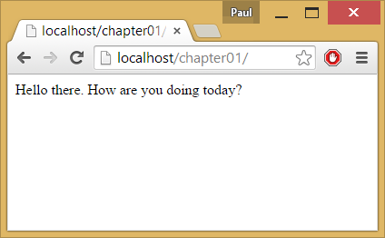
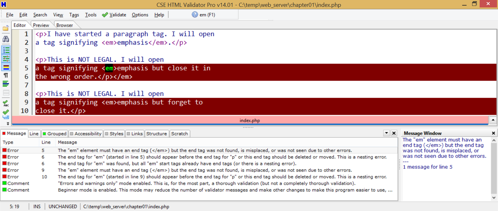

.. sectnum::
    :start: 4

HTML Tutorial
=============

First HTML Document
-------------------

*Note:* It is possible to do all the HTML and CSS experimentation on-line
with live editors like liveweave_. For this book I will show development using
a workflow that also works for more advanced development, which isn't easy to do live.
However, don't hesitate to experiment with HTML and CSS using websites like
LiveWeave because you can save a lot of time that way.

Create a directory on your computer called ``chapter01``.
Inside of that, create a file named ``index.html``.

Inside that document type a simple phrase like:

.. code:: html

    Hello there

Use a file browser to find the file. Then drag it to your web browser to open
it up. You should see something like:

.. image:: hello_there_1.png
    :width: 400px
    :align: center
    :alt: First Web Page


Now try the following code:

.. code:: html

    Hello there.
    How            are
    you
    doing


    today?

Try it out. Notice that everything is on the same line:



All white space, from one space, to 100 spaces and carriage returns are
treated as just one space. To tell the web browser we want different
paragraphs, we need to use a *tag*. Specifically, a paragraph
tag. It looks like this:

.. code:: html

    <p>Hello there.</p>
    <p>How are
    you doing today?</p>
    <p>I am fine.</p>

.. image:: hello_there_3.png
    :width: 400px
    :align: center
    :alt: First Web Page

All tags are enclosed in less than and greater than symbols, like ``<tag>``.
In this case, ``<p>`` is the paragraph tag. The p stands
for paragraph.

The content for the tag goes in between the open and close tags. All close
tags have a ``/`` before the tag name. In this case, we used ``</p>`` to
close the paragraph.

Tags can be nested. But you have to close inside tags before closing
outside tags. For example:

.. code-block:: html

    <p>I have started a paragraph tag. I will open
    a tag signifying <em>emphasis</em>.</p>

    <p>This is NOT LEGAL. I will open
    a tag signifying <em>emphasis but close it in
    the wrong order.</p></em>

    <p>This is NOT LEGAL. I will open
    a tag signifying <em>emphasis but forget to
    close it.</p>

Running this, you won't see errors:

.. image:: hello_there_4.png
    :width: 400px
    :align: center
    :alt: First Web Page

But if you validate the document using CSE Validator, it
will tell you what is wrong:



Some tags don't have content. They begin and end at the same time.
For example, the break-line tag does not have content.

.. code-block:: html

    <p>This is a new tag that doesn't start a new
    paragraph, it just goes to a<br />new line.</p>


Like many languages, HTML has comments. Comments are created
like the following:

``<!-- This is my comment -->``

*Important!* Unlike some languages, comments aren't removed from the user. Any user
can do a "View Source" in a web browser and see the comments. Therefore
don't write comments that you wouldn't want everyone in the web to be
able to read.

You can add headings. There are six "levels" to the headings, using tags h1...h6. For example:

.. code-block:: html

    <h1>First level heading</h1>
    <p>Paragraph.</p>

    <h2>Second level heading</h2>
    <p>Paragraph.</p>

    <h2>Another second level heading</h2>
    <p>Paragraph.</p>

    <h1>Back to first level heading</h1>
    <p>Paragraph.</p>

Here is a list of some of the most commonly used tags:

============= ===================
Tag           Description
============= ===================
<a>           Defines a hyperlink
<address>     Defines contact information for the author/owner of a document
<article>     Defines an article
<aside>       Defines content aside from the page content
<b>           Defines the document's body
<body>        Defines the document's body
<br>          Defines a single line break
<div>         Defines a section in a document
<em>          Defines emphasized text
<figcaption>  Defines a caption for a <figure> element
<figure>      Specifies self-contained content
<footer>      Defines a footer for a document or section
<h1> to <h6>  Defines HTML headings
<head>        Defines information about the document
<header>      Defines a header for a document or section
<hr>          Defines a thematic change in the content
<html>        Defines the root of an HTML document
<i>           Italics
         Defines an image
<kbd>         Defines keyboard input
<li>          Defines a list item
<link>        Defines the relationship between a document and an external resource (most used to link to style sheets)
<main>        Specifies the main content of a document
<meta>        Defines metadata about an HTML document
<nav>         Defines navigation links
<ol>          Defines an ordered list
<p>           Defines a paragraph
<pre>         Defines preformatted text
<script>      Defines a client-side script
<section>     Defines a section in a document
<small>       Defines smaller text
<span>        Defines a section in a document
<strong>      Defines important text
<style>       Defines style information for a document
<sub>         Defines subscripted text
<summary>     Defines a visible heading for a <details> element
<sup>         Superscripted text
<title>       Title for the document. Should be in head tag, shows up as title name but not on page.
<u>           Underline
============= ===================

One of the most popular tags is the ``<div>`` tag. This tag is used to define any
sort of 'divisions' on your web page. Basically, anything you'd want to put
in a box. Even other boxes. Because ``<div>`` is so generic, HTML5 added
common elements like ``<article>`` ``<footer>`` ``<section>`` and ``<summary>``. They act like
``<div>`` tags, but give a better description of their content.

Tag Attributes
--------------

Links
^^^^^

HTML tags can have attributes. For example, the <a> tag
allows us to create links to other pages and websites:

``<a>My link</a>``

We can specify not only the link text, but where the link goes:

``<a href="http://webdev.training">My link</a>``

How do we know what attributes we can use? Or even what tags? The official
documentation for the HTML5 ``<a>`` tag is here:

`http://www.w3.org/TR/2014/REC-html5-20141028/text-level-semantics.html#the-a-element <http://www.w3.org/TR/2014/REC-html5-20141028/text-level-semantics.html#the-a-element>`_


From that document, we can see other interesting attributes. For example ``target``
allows the developer to control if the new window opens up in a new window or tab.

But the official documentation is quite *dry*.
Rather than use the official documentation,
many people look it up on a website that is easier to navigate. For example w3schools:

http://www.w3schools.com/tags/tag_a.asp

Tags and tag attributes are not case sensitive. Code can use either.
But for the sake of the developer's sanity, you should only use lower case.

Images
^^^^^^

In a manner similar to links, you can also load images in your web page.
For this, we use the ``img`` tag, and the ``src`` attribute.
For example this will load ``happy_face.png`` image off the server:

````

It is good practice to keep images in a separate folder. For example:

````

Images can and should have ``alt`` text specified. If the image
can't load, this text will be displayed. If the user is blind, the screen
reader will read back the alt text.

````

There are many `image file formats`_. Here's the abridged version:

  * .jpg: Use JPEG's for photos or photo-like images.
  * .png: Use PNG's for graphic art.
  * .gif: Use GIF's for graphic art. These can be animated too.
  * .svg: Browser support for svg used to be poor, but is getting better.
    See `SVG Can Do That`_? SVG can scale to any resolution because it does
    not store "dots" that make up the image, but instead stores the drawing
    commands used to draw the image.

.. _SVG Can Do That: http://slides.com/sdrasner/svg-can-do-that

Normally the resolution of the image should match the resolution
that you want it to appear on the screen. Otherwise you force the user's
browser to download extra image data, and then scale it. This makes
for a slow website and poor image quality.

Note that each image file requires a separate request to the
server to get the image. Each image on a page slows down the
web page load time.

HTML Escape Characters
----------------------

What happens if we want to display a < and not have it
be part of a tag? For this and many other characters, we use
HTML Escape Characters. You can encode *any* character
this way, but most of them don't need to be encoded.

A full table of `HTML Escape Characters`_ can be found with
a quick web search. These are also known as HTML Entities.

To complicate matters, there is a *different* encoding scheme
for URLs. Remember, HTML makes up the structure of web documents.
URLs are the links to them. URLs can't have spaces in them and
there are many other characters that URLs can't have. So they
need to be encoded. Check the end of the w3schools HTML Escape Character
table to find the URL escape character table.

Example Document Structure
--------------------------

What does a bare-bones HTML5 document look like? Here is an example that will validate without
error using HTML Validator:

.. literalinclude:: base_web_document.html
    :linenos:
    :language: html


Lists
-----

Lists can be used for representing any hierarchical data. With CSS formatting, they can
look very different than what you might think of as a classic list. For example, drop down
menus are often done with lists.

Here is an example list. The main list is surrounded by an unordered list tag ``ul``.
Each list item is surrounded by a ``li`` tag.

.. code-block:: html

    <ul>
      <li>Item 1</li>
      <li>Item 2</li>
      <li>Item 3</li>
    </ul>

You can also have an ordered list, with the ``ol`` tag. Style sheets can
change a ``ul`` into a ``ol``, but good practice is to use ``ol``
for numbered lists.

.. code-block:: html

    <ol>
      <li>Item 1</li>
      <li>Item 2</li>
      <li>Item 3</li>
    </ol>


You can also have lists inside of lists. Notice how
Item 3's ``li`` tag does not end until *after*
the inside list closes.

.. code-block:: html

    <ul>
      <li>Item 1</li>
      <li>Item 2</li>
      <li>Item 3
        <ul>
          <li>Sub item A</li>
          <li>Sub item B</li>
          <li>Sub item C</li>
        </ul>
      </li>
      <li>Item 4</li>
      <li>Item 5</li>
    </ul>


Here is a slightly more complex HTML5 example that has some lists:

.. literalinclude:: simple_web_document.html
    :linenos:
    :language: html

Tables
------

============ =============
Tag          Description
============ =============
<table>      Surrounds the entire table
<tr>         Surrounds cells in a row
<td>         Surrounds a cell. Can use attributes ``rowspan`` and ``colspan`` to span multiple rows or columns.
<th>         Surrounds a header cell.
<thead>      Optional, usually surrounds the header row(s)
<tbody>      Optional, surrounds the main data rows
<tfoot>      Optional, surrounds the summary/footer rows
============ =============


.. code-block:: html

    <table>
      <thead>
        <tr>
          <th>Column 1</th>
          <th>Column 2</th>
          <th>Column 3</th>
        </tr>
      </thead>
      <tbody>
        <tr>
          <td>Cell</td>
          <td>Cell</td>
          <td>Cell</td>
        </tr>
      </tbody>
      <tfoot>
        <tr>
          <td>Summary 1</td>
          <td>Summary 2</td>
          <td>Summary 3</td>
        </tr>
      </tfoot>
    </table>


More Information
----------------

Books, Books, and More Books
^^^^^^^^^^^^^^^^^^^^^^^^^^^^

What we will learn in this class only scratches the surface of what there is to
learn. Take time to look at the resources that are available at `Dunn Library`_.
Search for HTML, HTML5, CSS, CSS3, and PHP. Spend some time in the library and
bookstores to see what is available.

Websites
^^^^^^^^

I really like `W3Schools`_ for tutorials and as a reference on HTML and many
other web technologies. Do note that
they do not have anything to do with the W3C organization, and there is some
hate for them on the Internet. Plus the "certifications" they sell for passing
tests aren't really worth anything.

Viewing HTML
^^^^^^^^^^^^

Did you know you can see the HTML of any web page?
When a web page is up, right-click and select "view source" or type Ctrl-U.
Is that too much HTML to wade through? Only want to see the HTML of a particular
element? Right click on it and select "inspect element."
Browsers have a "debug" menu available by hitting the F12 key. Give it a try.
Browsers offer many developer add-ons. For example, `Firebug`_ is a popular
add-on for Firefox. The built-in tools are good enough I rarely use add-ons anymore, but
you should know they are out there.

Validating HTML
^^^^^^^^^^^^^^^

The `CSE HTML Validator`_ is great for HTML work.
You can use it to load a URL and check if for correctness. You can have it automatically
check as you browse a website. It can even scan an entire website for errors in "batch"
mode.
CSE Validator has an option under "Tools" for "Pretty Print/Fix."
This will clean up the HTML formatting to make it easier to read. This can be useful
in learning techniques to make your HTML readable and structured.
If you don't want to shell out money, you can few a page's source, copy it,
and then paste it into Introduce `W3C`_ for validation.
This isn't as convenient, and you'll lose time compared to HTML Validator, but it does
work if you are on a budget.

One Last HTML Sample Document
^^^^^^^^^^^^^^^^^^^^^^^^^^^^^

.. literalinclude:: basic_html.html
    :linenos:
    :language: html

.. _liveweave: http://liveweave.com/
.. _HTML Escape Characters: http://dev.w3.org/html5/html-author/charref
.. _Dunn Library: http://www.simpson.edu/library/
.. _W3Schools: http://w3schools.com">w3schools.com
.. _CSE HTML Validator: http://www.htmlvalidator.com/
.. _W3C: http://validator.w3.org/
.. _Firebug: https://addons.mozilla.org/en-US/firefox/addon/firebug/
.. _image file formats: http://en.wikipedia.org/wiki/Image_file_formats
