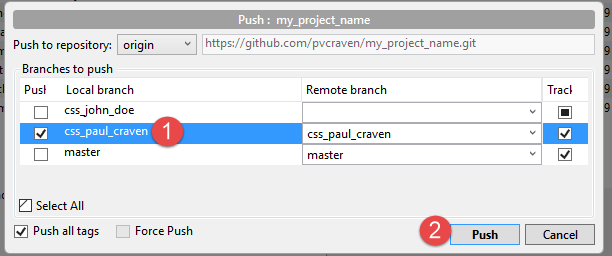
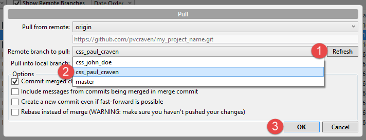
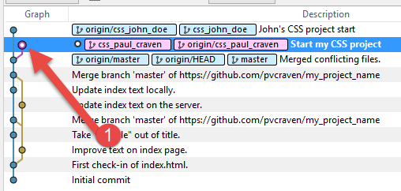

.. _branching-tutorial:

Branching Tutorial
------------------

Steps to successful branching.

* Make sure you have permission as a "collaborator" with the project.
* Make sure you have an up-to-date clone of the repository.
* Get started. Make a change to your files.
* Switch to SourceTree
* Select branch (step 1)
* Type in the name of your branch. For our first CSS assignment use
  ``css_firstname_lastname``. Obviously, replace first name and last name
  with your actual name. (step 2)
* Click "Create Branch" (step 3)

.. image:: branch_1.png
    :width: 600px
    :align: center
    :alt: Branching

* Commit your files.
* Push your files. When you push, select the new branch that you created
  (step 1) and then click push (step 2).

* You can now pull your branch, and even other people's branches. You may need
  to first hit "refresh" (step 1) to get the branches on the server. Then select
  the branch (step 2), then select "ok" (step 3).

* You can see what version is current by looking for the hollowed out circle
  on your list of revisions. (step 1)

* As long as you don't have any uncommitted changes, you can swap between
  branches by double-clicking on a commit.
* Note: If you edit files on a revision without a branch label, you can lose
  the changes. They are there, but without a label they are hard to find.
