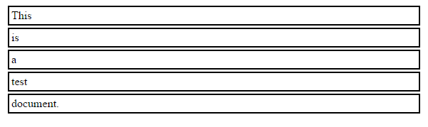
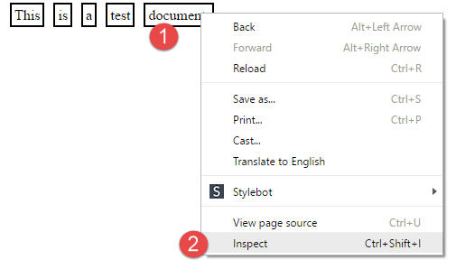
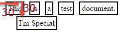
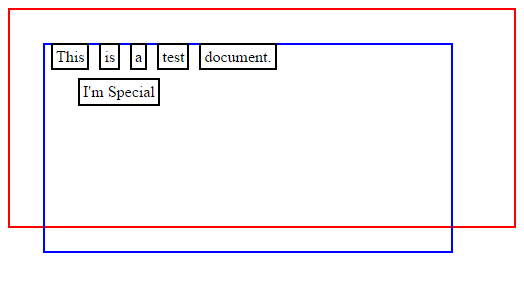

CSS Layout Tutorial
-------------------

Inline vs. Block
^^^^^^^^^^^^^^^^

Default is ``block`` for a ``
`` tag. This is what a bunch of blocks
look like. Note that they take the whole width, and work their way down the
page.

.. literalinclude:: demo_01.html
    :linenos:
    :language: html
    :emphasize-lines: 14

With ``inline``, which is the default for a ```` tag, everything flows
like text on a line. Try resizing the window so you get a line-wrap.

.. image:: demo_02.png
    :width: 270px
    :align: center
    :alt: Alt

.. literalinclude:: demo_02.html
    :linenos:
    :language: html
    :emphasize-lines: 10, 15

Inspect Elements
^^^^^^^^^^^^^^^^

You can do some really amazing things with modern web browsers. Select an element
on your page, and right-click on it. (Step 1 below.)

Then, select "inspect." (Step 2 below.)

Next, see that you'll get panels that open up with the page you see, the HTML,
and the CSS that is applied. As you click on the HTML (Step 1 below.) Note
that Chrome highlights the element on out page (Step 2 below.) It also shows
you the applied style (Step 3 below.)

.. image:: inspect_02.png
    :width: 640px
    :align: center
    :alt: Alt

You can double click on the style information and change it! But the changes
are not saved in your document. They are only temporary.

.. image:: inspect_03.png
    :width: 200px
    :align: center
    :alt: Alt

Position
^^^^^^^^

Looking to center or right align a block? It isn't intuitive. Here it is:

.. image:: demo_06.png
    :width: 550px
    :align: center
    :alt: Alt

.. literalinclude:: demo_06.html
    :linenos:
    :language: html
    :emphasize-lines: 34, 38, 39

You can also "float" items. Resize the window and see some odd things. Note
that floating objects are not contained in the ``section`` tag, but float outside
of it.

.. image:: demo_07.png
    :width: 640px
    :align: center
    :alt: Alt

.. literalinclude:: demo_07.html
    :linenos:
    :language: html

By default positions are ``static`` and ignore top, bottom, left, right directives.
If instead you select ``relative``, then you can set ``top`` and ``left``
values to specify how many pixels *relative* to the last element should this
new element be.

**Important:** You can also specify negative numbers. Try it!

.. image:: demo_03.png
    :width: 320px
    :align: center
    :alt: Alt

.. literalinclude:: demo_03.html
    :linenos:
    :language: html
    :emphasize-lines: 17, 18, 19

If you select ``absolute``, then the element is **not** relative to the last\prior
element. From the name, it would be reasonable to think that "absolute" positioning
means "absolutely place this here." And that it would not be relative to anything.

Not so. Absolute positioning is relative to the element that *contains* it. Rather
than relative to the prior element. In the example below, the special element
is relative to the ``<section>`` tag. Which you can't see.

.. literalinclude:: demo_04.html
    :linenos:
    :language: html

Here, we style the ``<section>`` tag. This makes it a little easier to see
how the document is relative to the position of the ``<section>`` tag.

.. literalinclude:: demo_05.html
    :linenos:
    :language: html

There are many limitations to the original CSS's layout options. Version 3 of
CSS (CSS3) includes `flex box`_ which is supposed to help. There are other
CSS libraries that have their own method of layout.

.. _flex box: http://www.w3schools.com/css/css3_flexbox.asp
