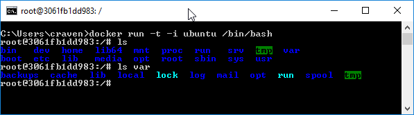
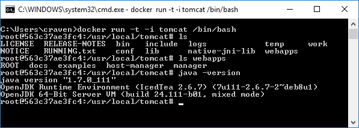

Docker Tutorial
===============

Download and install Docker.

Next, let's run a Docker command. The command below will run a copy of
Ubuntu Linux. If
you don't have it, Docker will automatically download it for you. Pretty cool.

::

    docker run ubuntu

Except, um, we have no way to interact with the machine we created. It *did*
run. But there was nothing to do so it stopped.

We need to add a few options. I found these options by a whole lot of Googling.
Unfortunately by
just feeding the answer to you here I'm making you miss the frustration of
configuration. Oh well.

Here's the full reference if your are curious:
`Docker command line reference for the run command`_.

The new options:

* ``-t``: Allocate a terminal for us to see text from the VM.
* ``-i``: Allow us to type input on the terminal.
* ``/bin/bash``: Once the operating system starts, run the ``bash`` program, which
  is the terminal shell program we type stuff into.

.. _Docker command line reference for the run command: https://docs.docker.com/engine/reference/commandline/run/

Our new command with the new options:

::

    docker run -t -i ubuntu /bin/bash

We can see the files in there by typing the ``ls`` command:

Great! Besides the Ubuntu Docker image, there is also one for the Tomcat
Java application server. We can run that in a similar manner::

    docker run -t -i tomcat /bin/bash

And we can see we've got a container with Tomcat and Java installed:

There are three things we need, before we can get this container to be useful
to us:

* We need a way we can pass files from the website we create on our
  computer, to the server in the container.
* We need to open a network connection so we can hook our web browser to the
  server.
* We need to start the server.

We can accomplish the first with the ``-v`` option.

::

    docker run -t -i -v c:/temp:/usr/local/tomcat/webapps/temp tomcat /bin/bash
    docker run -v /temp:/usr/local/tomcat/webapps/temp -p 8080:8080 tomcat
