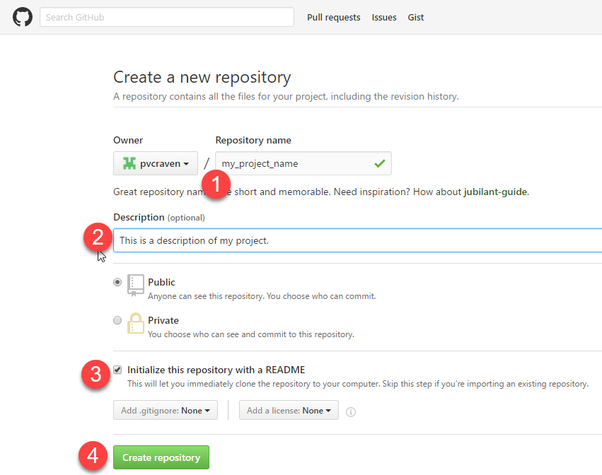
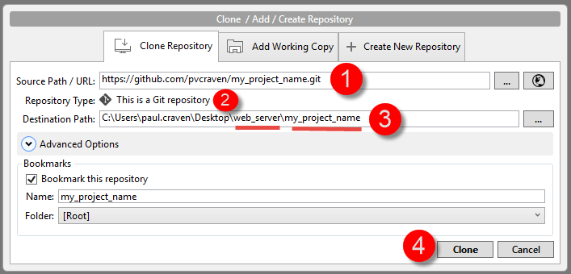
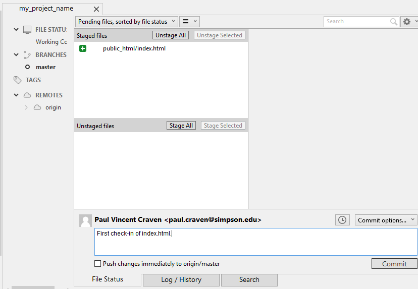
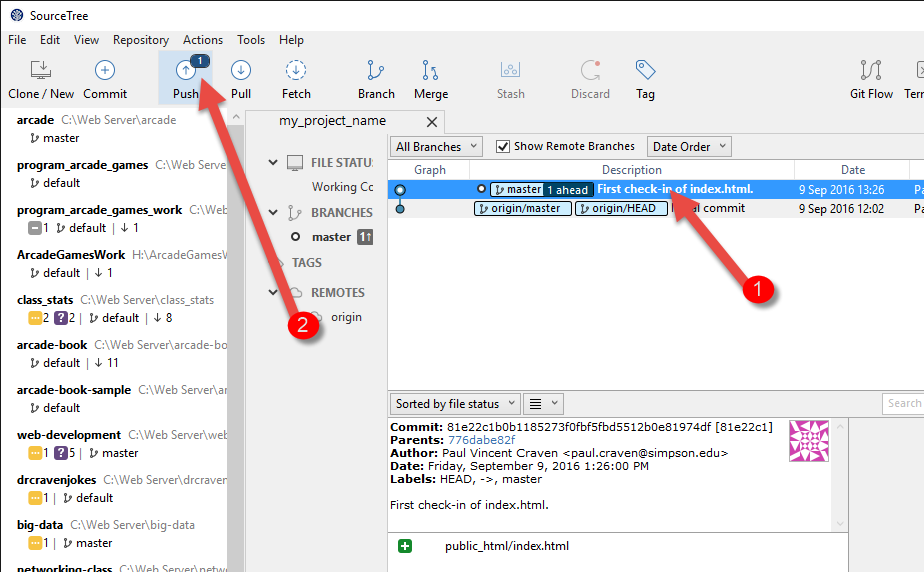
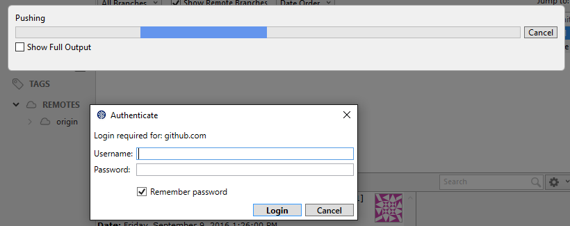
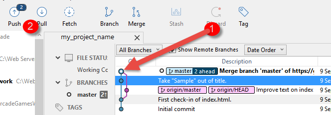
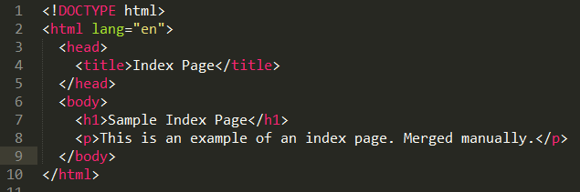

Distributed Version Control System Tutorial
-------------------------------------------

Installing SourceTree
^^^^^^^^^^^^^^^^^^^^^

Changes that you and other developers make to the code are stored in "code
repositories."

Just like the web can be browsed with different web browsers, code repositories
can be browsed with different clients. We'll use a client called SourceTree.

Download SourceTree from:

http://www.sourcetreeapp.com

SourceTree is a nice GUI application that helps work with our repositories.
It actually works on top of tools like *Git* and *Mercurial* to make them easier
to use. These tools are "command-line" tools that operate only by typing in
commands. They have no menus.
You can do a lot more by manually typing in commands on the command line,
but that is beyond the scope of this tutorial. And so we use SourceTree.

You will need to `create an account with Atlassian`_. Accounts ending in ``.edu``
can get extra features, so I recommend signing up with your school e-mail.

Installation of SourceTree should be straight-forward. However, when your first
run SourceTree it wants to do *more* setup. You'll see a screen like this:

.. image:: source_tree_setup_1.png
    :width: 400px

Then you will need to log in with that Atlassian account you created:

.. image:: source_tree_setup_2.png
    :width: 400px

You could hook up GitHub here. But don't. Just skip this step:

.. image:: source_tree_setup_3.png
    :width: 400px

You probably don't have an SSH key. So skip this step. (I like how the text says
click "no" but there is not a button named "no.")

.. image:: source_tree_setup_4.png
    :width: 350px

SourceTree is a pretty GUI on top of Git. So we need a copy of Git. Go ahead
and install it:

.. image:: source_tree_setup_5.png
    :width: 350px

Then do the same thing with Mercurial:

.. image:: source_tree_setup_6.png
    :width: 350px

Getting Started with GitHub
^^^^^^^^^^^^^^^^^^^^^^^^^^^

After installing SourceTree, `create an account with GitHub`_. GitHub is where
we will store the code that we write. It is a very popular web site for code
management. Particularly open-source software.

Creating Your Project in GitHub
^^^^^^^^^^^^^^^^^^^^^^^^^^^^^^^

* One person in your team should create a project. Don't create a project for each
  person.
* Give your project a name. All lower case. Separate words with underscores.
  Do not use spaces. And don't *actually* call your project ``my_project_name``
  because that would be silly.
* Give a short one-sentence description of what your project is.
* Include a 'readme' in your project. If you don't do this your project will
  start as blank, and you'll get a really confusing screen.
* The other options can be left as default..

* After creating the project, invite the instructor (``pcraven`` if it is
  Dr. Craven) and your team mates. Do this by clicking Settings...Collaborators.
  Then it will ask for your password. Then start entering usernames.

.. image:: github_2.png
    :width: 450px

* Each user will receive an e-mail confirming he or she would like to be part
  of the project. Click the confirmation link sent.

Cloning Your GitHub Project on Your Computer
^^^^^^^^^^^^^^^^^^^^^^^^^^^^^^^^^^^^^^^^^^^^

* Clone the project onto your computer. First, copy the link from GitHub in your
  web browser:

.. image:: github_3.png
    :width: 450px

* Then switch to SourceTree. Hit the "Clone / New" button.
* Paste the URL you copied into Source Path / URL. See point 1 below.
* Click into "Destination Path". When you do this, SourceTree will check your URL and
  say "This is a Git repository." See point 2 below.
* If you DON'T get that it is a Git repository, check your URL. If that is
  correct, cancel out of this dialog box and go to the menu bar.
  Click Tools...Options. Then select the
  "Git" tab. Make sure Git is installed. If it isn't, then install it.
* Find a place for your projects. Create a folder called ``web_server``. Then
  create a folder that matches your project name. See point 3 below.
* Click "Clone"

* Your repository should be cloned. You can see where your files are by looking
  at the barely-legible text to the right of your project entry. Or you can just
  right-click on the project and "Show in Explorer"

.. image:: source_tree_setup_7.png
    :width: 400px

Committing
^^^^^^^^^^

* Create the directory structure as shown in the assignment
* Add YOUR files, and your files only, to the project
* Go to SourceTree. You should see a line "Uncommitted Changes" appear.
  Click that. See point 1 below if you can't find it.
* Stage the files by clicking "Stage All". Point 2.

.. image:: source_tree_commit_1.png
    :width: 400px

* Commit the files
* Put in a comment about what you did. This is important, because it allows
  other people (and you) to know what was done in the project.

* Once you've committed, you should see a line on your history with the comment
  you made. You can click on that line to see what changed.
* At this point SourceTree may ask you for your username, and your email address.
  This is just what will appear next to the "commit" to say who did the committing.
  Note that SourceTree might helpfully fill in something like ``SC\paul.craven``
  as your name. This is not your name. Nor is something like ``paul.craven``. Your
  name is something like ``Paul Craven``. And no, don't put in *my* name, but in
  *your* name. Once stored, it won't ask you for this info again.
* The "Push" button should have a number next to it. This is the number of change
  sets that you've made on your computer, but that are not on the server.
* Go ahead and click "Push" to push them to the server

* Another dialog box will pop up. Just click "Push" again.
* We *still* haven't pushed. We need to log in:

* Great! Now your code is on the server. You can go to GitHub and see it.

Merging Changes
^^^^^^^^^^^^^^^

* If you push to the server, and someone else has already done so, your push
  will error out.

.. image:: source_tree_commit_5.png
    :width: 400px

* We can't push our changes because we don't have the most recent changes from
  the server. So we need to pull them first. Cancel out of this dialog box by
  hitting "close."
* The other dialog is still open, so hit "Cancel"
* Select "pull"
* If you get an error, see below on "How to Resolve Conflicts"
* Click "ok" on the pull dialog box
* As long as there are no conflicts, the changes will be automatically
  merged together. You can see the two separate "streams" and where they merged.
  See point 1.
* Select "push". See point 2.

* Now your items are on the server!

How to Resolve Conflicts
^^^^^^^^^^^^^^^^^^^^^^^^

* When two people both change the same lines of code, we can't automatically
  merge the files together. We'll get an error that looks like this when we pull:

.. image:: source_tree_commit_7.png
    :width: 450px

* At this point we **have** pulled the changes. They just aren't merged.
* Hit 'Cancel'. Which is weird because the changes were already pulled.
* Click uncommitted changes (point 1)
* Right-click files with an exclamation point. These have conflicts. (point 2)
* Select Resolve Conflicts (point 3)
* Choose how to resolve the conflict. You can:

  * Ignore the stuff on the server, and use the copy you have on your computer.
    "Resolve using **mine**" (point 4)
  * Ignore the stuff on your computer, and go with what is on the server.
    "Resolve using **theirs**" (point 5)
  * Manually change the text. Then tell the computer everything is ok. Don't
    select this option until you merge the text yourself. See below. (point 6)

.. image:: source_tree_commit_8.png
    :width: 500px

* The first two options are the easiest. If you need to manually merge the files,
  open the files and you'll see stuff like this:

.. image:: source_tree_commit_9.png
    :width: 500px

* You have BOTH sets of changes. And some really weird divider lines. Edit this,
  remove the extra junk added in:

* Then "Mark Resolved" from the step above.

* Commit. The comment will be filled in for you.
* Then push.

.. _create an account with Atlassian: https://id.atlassian.com/signup?application=mac&continue=https%3A%2F%2Fmy.atlassian.com%2Fproducts%2Findex

.. _create an account with GitHub: https://github.com/
