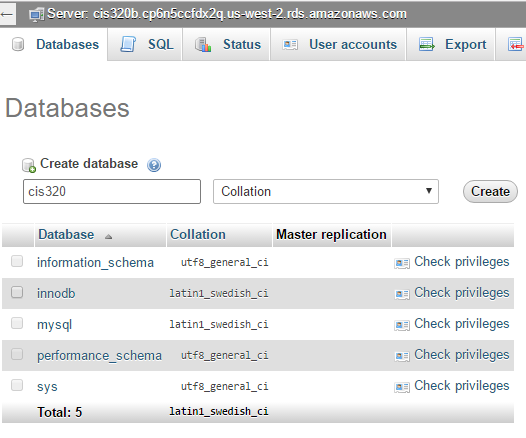

Setup Amazon Database
=====================

Ok, here's a set of screen shots on how to set up a database to use.

Create the Amazon Database Instance
-----------------------------------

Go into the RDS section of AWS.

.. figure:: rds.png

    Go into the RDS section of AWS

Launch a DB instance. NOT aurora.

.. figure:: launch_instance.png

    Launch a DB instance. NOT aurora.

Select your engine.

.. figure:: select_engine.png

    Select your engine.

Make it a test instance. Because those are free.

.. figure:: dev_test.png

    Make it a test instance. Because those are free.

Set the instance specifications.

.. figure:: instance_specifications.png

    Set the instance specifications.

Set the username and password.

.. figure:: advanced_settings.png

    Set the username and password.

.. important:: Use a Strong Password!

    There will people trying to guess the password of your database. Create a
    long random password and make it secure!!! Also, don't re-use a password
    you've got somewhere else. Because we'll be putting the password in an
    insecure location.

Set Up MyPHPAdmin to Point to RDS
---------------------------------

Ok. Now we have a database. But no way to administer the database. You know,
create tables, see what's in it, run ad-hoc SQL. There is a great program in
XAMPP that let's us to this. However, right now it is pointed to the database
on your computer. We want to point to the Amazon web server.

Note: This will change things for everyone on the computer. So if you switch
to another computer, your changes won't follow. You might even want to remove
the settings when you are done to keep other people from messing up your
database.

Edit ``C:\xampp\phpMyAdmin\config.inc.php``

Note your endpoint and your password from the server you set up on-line.
Change the original file from::

    /* Authentication type and info */
    $cfg['Servers'][$i]['auth_type'] = 'config';
    $cfg['Servers'][$i]['user'] = 'root';
    $cfg['Servers'][$i]['password'] = '';
    $cfg['Servers'][$i]['extension'] = 'mysqli';
    $cfg['Servers'][$i]['AllowNoPassword'] = true;
    $cfg['Lang'] = '';

    /* Bind to the localhost ipv4 address and tcp */
    $cfg['Servers'][$i]['host'] = '127.0.0.1';
    $cfg['Servers'][$i]['connect_type'] = 'tcp';

To the new settings of::

	/* Authentication type and info */
	$cfg['Servers'][$i]['auth_type'] = 'config';
	$cfg['Servers'][$i]['user'] = 'cis320';
	$cfg['Servers'][$i]['password'] = 'myverysecretrandompassword';
	$cfg['Servers'][$i]['extension'] = 'mysqli';
	$cfg['Servers'][$i]['AllowNoPassword'] = true;
	$cfg['Lang'] = '';

	/* Bind to the localhost ipv4 address and tcp */
	$cfg['Servers'][$i]['host'] = 'cis320.cp6n5ccfdx2q.us-west-2.rds.amazonaws.com';
	$cfg['Servers'][$i]['connect_type'] = 'tcp';

Great! Now go to: ``http://localhost/phpmyadmin/``.

Create a new table for our
database. Make it look like:

.. image:: create_table.png

Then add a few new records.
