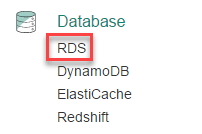
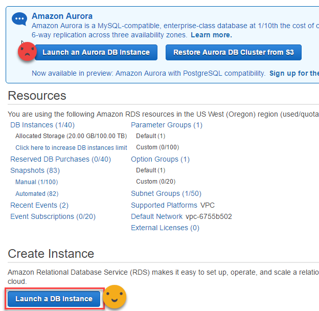
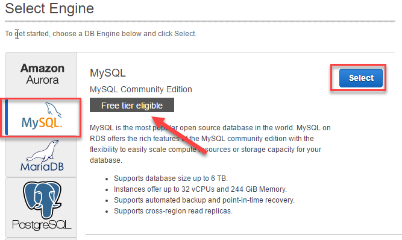
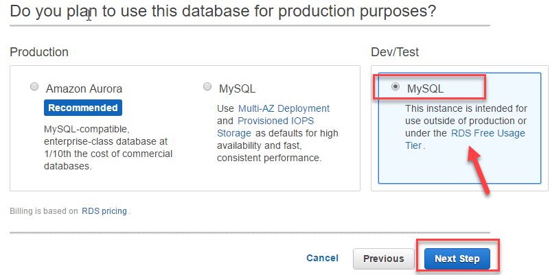
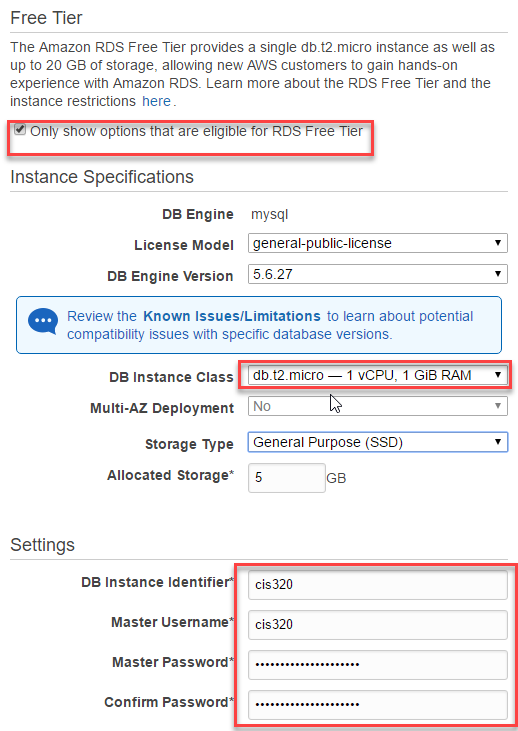
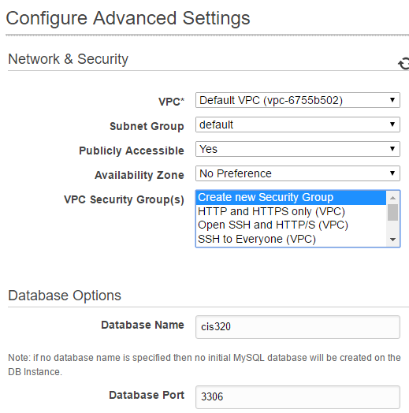
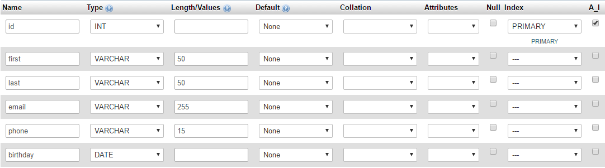

Setup Amazon Database
=====================

Edit ``C:\xampp\phpMyAdmin\config.inc.php``

Note your endpoint and your password from the server you set up on-line.
Change config file to::

	/* Authentication type and info */
	$cfg['Servers'][$i]['auth_type'] = 'config';
	$cfg['Servers'][$i]['user'] = 'cis320';
	$cfg['Servers'][$i]['password'] = 'myverysecretrandompassword';
	$cfg['Servers'][$i]['extension'] = 'mysqli';
	$cfg['Servers'][$i]['AllowNoPassword'] = true;
	$cfg['Lang'] = '';

	/* Bind to the localhost ipv4 address and tcp */
	$cfg['Servers'][$i]['host'] = 'cis320.cp6n5ccfdx2q.us-west-2.rds.amazonaws.com';
	$cfg['Servers'][$i]['connect_type'] = 'tcp';

