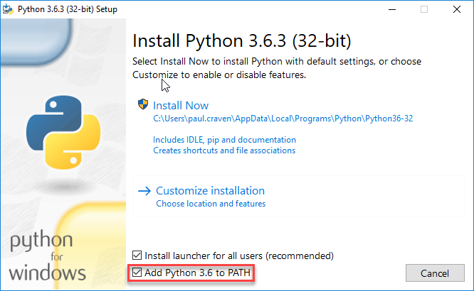
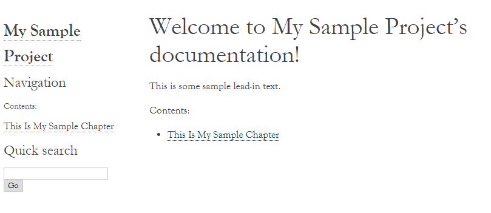

Sphinx Tutorial
===============

`Sphinx <http://www.sphinx-doc.org/>`_ is a static content generator. This tutorial covers how to
get Sphinx up and running.

Installation on Windows
-----------------------

The lab computers have everything installed, so they are ready to go. If you are using a lab computer
you can skip to the next step.

If you want to build the site on your personal Windows computer, you'll need to install Python and Sphinx.

This can also be installed on a Mac, but it is a bit more complex. I suggest using the lab computer or drop
by my office.

Sphinx relies on the computer language *Python*. You don't need to understand Python to use
the tool. But it does need to be installed on the computer first.

First, you'll need to install Python. Download Python from:

https://www.python.org/downloads/

When you do the installation, make sure to select "Add Python to PATH":

To install Sphinx, run the "Command Prompt" on your windows computer.
You'll need to run it as an administrator:

.. image:: command_as_admin.png
    :width: 40%

Then type in the following command:

.. code-block:: text

    pip install sphinx sphinx_rtd_theme

You'll see something like this, plus a lot more::

    C:\Users\paul.craven>pip install sphinx
    Collecting sphinx
      Downloading Sphinx-1.4.9-py2.py3-none-any.whl (1.6MB)
        100% |################################| 1.6MB 675kB/s

Did it work? Great! Now we are ready to start our site.

Did it not work? Drop by and we can trouble-shoot it.

Create the Initial Project
--------------------------

First, create a new directory inside of where your web server has its files.

Then, open a command prompt and navigate to that directory. Remember to use
the ``cd`` command to change directories. Make sure you are in this new directory
you've created before you continue. Otherwise you'll have a mess.

Then, type in ``sphinx-quickstart``. You'll be led through a list of questions
to start your project. Unfortunately the current version is bugged on Windows
and rather than outputting the questions in fancy colors you just see a bunch
of strange characters on your monitor. Just ignore those, and answer the questions
as I've shown below. Note that most of the questions I just take the default and
hit "enter."

.. code-block:: text

    C:\Users\craven\sample_sphinx_project>sphinx-quickstart
    Welcome to the Sphinx 1.6.3 quickstart utility.

    Please enter values for the following settings (just press Enter to
    accept a default value, if one is given in brackets).

    Enter the root path for documentation.
    > Root path for the documentation [.]:

    You have two options for placing the build directory for Sphinx output.
    Either, you use a directory "_build" within the root path, or you separate
    "source" and "build" directories within the root path.
    > Separate source and build directories (y/n) [n]: y

    Inside the root directory, two more directories will be created; "_templates"
    for custom HTML templates and "_static" for custom stylesheets and other static
    files. You can enter another prefix (such as ".") to replace the underscore.
    > Name prefix for templates and static dir [_]:

    The project name will occur in several places in the built documentation.
    > Project name: My Sample Project
    > Author name(s): Paul Craven

    Sphinx has the notion of a "version" and a "release" for the
    software. Each version can have multiple releases. For example, for
    Python the version is something like 2.5 or 3.0, while the release is
    something like 2.5.1 or 3.0a1.  If you don't need this dual structure,
    just set both to the same value.
    > Project version []:
    > Project release []:

    If the documents are to be written in a language other than English,
    you can select a language here by its language code. Sphinx will then
    translate text that it generates into that language.

    For a list of supported codes, see
    http://sphinx-doc.org/config.html#confval-language.
    > Project language [en]:

    The file name suffix for source files. Commonly, this is either ".txt"
    or ".rst".  Only files with this suffix are considered documents.
    > Source file suffix [.rst]:

    One document is special in that it is considered the top node of the
    "contents tree", that is, it is the root of the hierarchical structure
    of the documents. Normally, this is "index", but if your "index"
    document is a custom template, you can also set this to another filename.
    > Name of your master document (without suffix) [index]:

    Sphinx can also add configuration for epub output:
    > Do you want to use the epub builder (y/n) [n]: y

    Please indicate if you want to use one of the following Sphinx extensions:
    > autodoc: automatically insert docstrings from modules (y/n) [n]:
    > doctest: automatically test code snippets in doctest blocks (y/n) [n]:
    > intersphinx: link between Sphinx documentation of different projects (y/n) [n]:
    > todo: write "todo" entries that can be shown or hidden on build (y/n) [n]:
    > coverage: checks for documentation coverage (y/n) [n]:
    > imgmath: include math, rendered as PNG or SVG images (y/n) [n]:
    > mathjax: include math, rendered in the browser by MathJax (y/n) [n]: y
    > ifconfig: conditional inclusion of content based on config values (y/n) [n]:
    > viewcode: include links to the source code of documented Python objects (y/n) [n]:
    > githubpages: create .nojekyll file to publish the document on GitHub pages (y/n) [n]: y

    A Makefile and a Windows command file can be generated for you so that you
    only have to run e.g. `make html' instead of invoking sphinx-build
    directly.
    > Create Makefile? (y/n) [y]:
    > Create Windows command file? (y/n) [y]:

    Creating file .\source\conf.py.
    Creating file .\source\index.rst.
    Creating file .\Makefile.
    Creating file .\make.bat.

    Finished: An initial directory structure has been created.

    You should now populate your master file .\source\index.rst and create other documentation
    source files. Use the Makefile to build the docs, like so:
       make builder
    where "builder" is one of the supported builders, e.g. html, latex or linkcheck.

Great! Now we have an initial file setup.

Building the project
--------------------

When you are at the command prompt, type ``make html``.

.. code-block:: text

    C:\Users\craven\sample_sphinx_project>make html
    Running Sphinx v1.6.3
    making output directory...
    loading pickled environment... not yet created
    building [mo]: targets for 0 po files that are out of date
    building [html]: targets for 1 source files that are out of date
    updating environment: 1 added, 0 changed, 0 removed
    reading sources... [100%] index
    looking for now-outdated files... none found
    pickling environment... done
    checking consistency... done
    preparing documents... done
    writing output... [100%] index
    generating indices... genindex
    writing additional pages... search
    copying static files... done
    copying extra files... done
    dumping search index in English (code: en) ... done
    dumping object inventory... done
    build succeeded.

    Build finished. The HTML pages are in build\html.

    C:\Users\craven\sample_sphinx_project>

Sphinx will then generate
your website in the ``build/html`` folder. You can go there with your web browser
and load up the main page.

While you can grab the ``index.html`` file and put in your browser to view,
it is a better habit to go through the web server by putting in ``localhost`` on
your address bar.

You will modify the files in the ``source`` directory, and then run ``make html``
on the command prompt. Finally you'll see the results in the ``build`` directory.

Adding Content
--------------

In your source directory, you should have a ``index.rst`` folder that looks like
this:

.. code:: rst

    .. My Sample Project documentation master file, created by
       sphinx-quickstart on Mon Nov 27 13:58:37 2017.
       You can adapt this file completely to your liking, but it should at least
       contain the root `toctree` directive.

    Welcome to My Sample Project's documentation!
    =============================================

    .. toctree::
       :maxdepth: 2
       :caption: Contents:

    Indices and tables
    ==================

    * :ref:`genindex`
    * :ref:`modindex`
    * :ref:`search`

The first part is just a comment. And I don't every use the "Indices and tables."
So let's trim those and simplify the file:

.. code-block:: text

    Welcome to My Sample Project's documentation!
    =============================================

    .. toctree::
       :maxdepth: 2
       :caption: Contents:

Let's add to our file:

.. code-block:: text

    Welcome to My Sample Project's documentation!
    =============================================

    This is some sample lead-in text.

    .. toctree::
       :maxdepth: 2
       :caption: Contents:

       sample_chapter/index

I've added a bit of lead-in text.

The Table of Contents Tree (toctree) should be a list of files that you want
to include. I typically make one file per page, and put each page in its own
directory. That makes it easy to keep the images and code samples for a page
together.

I've also told Sphinx to look in the ``sample_chapter`` directory for a file called
``index.rst``. Let's create that file and directory now. (Make sure you don't accidentally
create something like ``index.rst.txt`` if you still are hiding file extensions.) Put this in the file:

.. code-block:: rst

    This Is My Sample Chapter
    =========================

    Ok, here's my sample chapter.

Rebuild your file:

.. code-block:: text

    C:\Users\craven\sample_sphinx_project>make html
    Running Sphinx v1.6.3
    loading pickled environment... done
    building [mo]: targets for 0 po files that are out of date
    building [html]: targets for 1 source files that are out of date
    updating environment: 1 added, 1 changed, 0 removed
    reading sources... [100%] sample_chapter/index
    looking for now-outdated files... none found
    pickling environment... done
    checking consistency... done
    preparing documents... done
    writing output... [100%] sample_chapter/index
    generating indices... genindex
    writing additional pages... search
    copying static files... done
    copying extra files... done
    dumping search index in English (code: en) ... done
    dumping object inventory... done
    build succeeded.

    Build finished. The HTML pages are in build\html.

    C:\Users\craven\sample_sphinx_project>

Now find the build directory, and open up the result in your browser. It should look something like:

To get the full details on what you can do,
read this `Introduction to Restructured Text <http://www.sphinx-doc.org/en/stable/rest.html>`_
Below I have a quick demo that gives some examples of what you can do:

.. code-block:: text

    This Is My Sample Chapter
    =========================

    Ok, here's my sample chapter.

    This is another paragraph because of the blank line.

    This
    is
    all
    one paragraph. Because there
    is
    no blank
    line.

    Here I use *one* paire of asterisks for italics.

    I can use **two** pairs of asterisks for bold.

    Like lists?

    * Start a list with an asterisk.
    * Each item gets one.
    * Most common mistake, if you need two lines
      don't forget to indent the second line.

      * You can have a list in a list too.
      * Don't forget a blank line between the lists

    * Done with lists.

    Heading Level 1
    ---------------

    You can create headings with - and = and ~ underlines.

    You can create a link by doing `Simpson`_ something like this.

    .. _Simpson: http://simpson.edu

    You can do sample code easily:

    .. code-block:: python
        :linenos:
        :caption: Sample Code

        # Sample program
        print("Hello")

    You can make ``monospaced text`` if you surround them with two back-ticks. Back-ticks are the
    weird quote thing in the upper-left on your keyboard.

    You can include an image by:

    .. image:: my_image.png
        :width: 50%

    Or a labeled image:

    .. figure:: my_image.png
        :width: 50%

        This is my image caption.

    Sample Table
    ------------

    This is a sample table

    ============ =================
    Fruit        Review
    ============ =================
    Apple	     ``***``
    Pomegranite  ``*****``
    Grapes       ``***``
    Pears        ``****``
    Orange       ``**``
    Cherries     ``*``
    ============ =================

    There are several ways of doing sample tables. The most frequent issue
    that people have when making tables is mixing tabs and spaces. In Sublime,
    if you select the text of a table, you can see tabs look differently than
    spaces. Always use spaces, never tabs.

Check for Errors
----------------

Sphinx will try to build *something* even if there is an error. That doesn't mean you should ignore the
errors! They will be very apparent to me when I look the project. So correct the errors that you
find. For example, see below:

.. code-block:: text

    Running Sphinx v1.6.3
    loading pickled environment... done
    building [mo]: targets for 0 po files that are out of date
    building [html]: targets for 1 source files that are out of date
    updating environment: 0 added, 1 changed, 0 removed
    reading sources... [100%] sample_chapter/index
    C:\Web Server\sample_sphinx_project\source\sample_chapter\index.rst:: WARNING: image file not readable: sample_chapter\my_image.png
    C:\Web Server\sample_sphinx_project\source\sample_chapter\index.rst:63: WARNING: image file not readable: sample_chapter\my_image.png
    looking for now-outdated files... none found
    pickling environment... done
    checking consistency... done
    preparing documents... done
    writing output... [100%] sample_chapter/index
    generating indices... genindex
    writing additional pages... search
    copying static files... done
    copying extra files... done
    dumping search index in English (code: en) ... done
    dumping object inventory... done
    build succeeded, 2 warnings.

    Build finished. The HTML pages are in build\html.

There are two warnings, telling me it can't load the image that I wanted. I need to correct that, not ignore it.

Themes And The Configuration File
---------------------------------

You can change the look of your output website by changing the ``conf.py`` file.
There is a line in there that allows you to change between different themes.

`Here <http://www.sphinx-doc.org/en/1.4.8/theming.html>`_ are different built-in
themes available. You can also download themes. For example, this website uses
the "Read the Docs" theme with some other customizations.

Spend some time looking in ``conf.py`` to see what you can do with it.

Sublime
-------

If you create a project with sublime, and then add a folder to that project, you get a nice side-bar that
lets you quickly switch between files.

Under "Preferences...Settings" you can modify the setting file for Sublime. You shouldn't type past 80 or at
the very least 120 characters for your line length. You can set up a ruler for this. You can enable the
spell-checker. You can automatically convert tab characters to spaces so your tables don't
get messed up. Here is what I use:

.. code-block:: JSON

    {
        "color_scheme": "Packages/Color Scheme - Default/Monokai.tmTheme",
        "font_size": 12,
        "rulers": [80],
        "spell_check": true,
        "translate_tabs_to_spaces": true,
        "word_wrap": false,
    }

If you don't want to open a command-prompt to build your documentation, you can create a new build-system
in Sublime. This will allow you to just hit Ctrl-B to build your project. The build file is a bit confusing,
and I have to look it up anytime I want to add it, but it looks like this:

.. code-block:: JSON

    {
        "working_dir": "${project_path}",
        "shell_cmd": "make html"
    }

Putting The Project In GitHub
-----------------------------

Ok, now we've got the start of our project. We need to create a new project
on GitHub and push our project there.

.. image:: create_github_project.png
    :width: 500px
    :align: center

Give it a name:

.. image:: create_github_project_2.png
    :width: 500px
    :align: center

Copy this URL:

.. image:: create_github_project_3.png
    :width: 500px
    :align: center

Then, go to SourceTree and create a repository in that directory we created:

.. image:: create_github_project_4.png
    :width: 640px
    :align: center

We *don't* want to add the output files to SourceTree. Version Control Systems
are for source code, not output code. We need to ignore all the files in the
``build`` directory. Right click on the first file in the build directory:

.. image:: create_github_project_5.png
    :width: 500px
    :align: center

And then ignore that directory:

.. image:: create_github_project_6.png
    :width: 400px
    :align: center

Now we can add all the files we have to version control:

.. image:: create_github_project_7.png
    :width: 550px
    :align: center

Once the files are checked in, we need to tell SourceTree what GitHub project
to push to. Select "Add Remote":

.. image:: create_github_project_8.png
    :width: 300px
    :align: center

Then paste in that URL we copied to the SECOND box.

.. image:: create_github_project_9.png
    :width: 550px
    :align: center

Then you should be able to "push" the "master" branch.