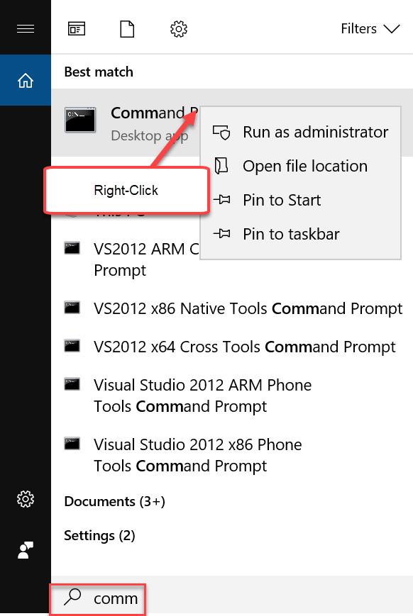
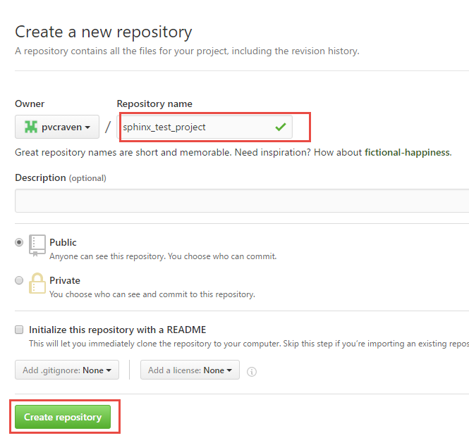
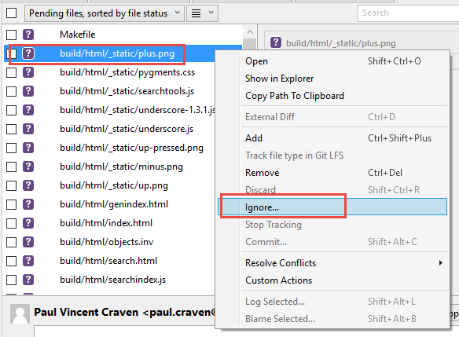
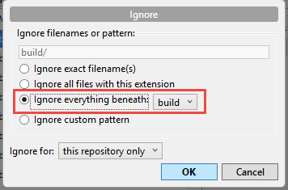
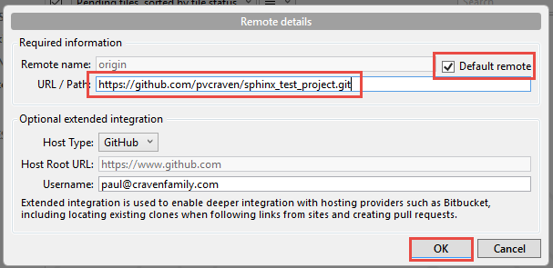
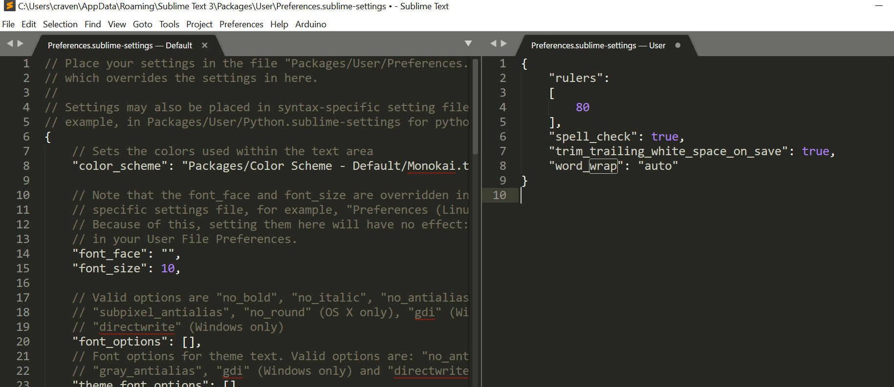

Sphinx Tutorial
===============

Installation
------------

`Sphinx <http://www.sphinx-doc.org/>`_ is a static content generator. It relies
on the computer language *Python*. You don't need to understand Python to use
the tool. But it does need to be installed on the computer first.

The lab
computers have Python installed, so they are ready to go. If you want to
build the site on your personal computer, you'll need Python installed first.
See me if you need help doing this step.

To install Sphinx, run the "Command Prompt" on your windows computer. Then
type in the following command::

    pip install sphinx

You'll see something like this, plus a lot more::

    C:\Users\paul.craven>pip install sphinx
    Collecting sphinx
      Downloading Sphinx-1.4.9-py2.py3-none-any.whl (1.6MB)
        100% |################################| 1.6MB 675kB/s

Did it work? Great! Now we are ready to start our site.

Did it not work? You might need to start the command prompt as an admin:

Then try running the command.

Create the initial project
--------------------------

First, create a new directory inside of where your web server has its files.

Then, open a command prompt and navigate to that directory. Remember to use
the ``cd`` command to change directories. Make sure you are in this new directory
you've created before you continue. Otherwise you'll have a mess.

Then, type in ``sphinx-quickstart``. You'll be led through a list of questions
to start your project. Unfortunately the current version is bugged on Windows
and rather than outputting the questions in fancy colors you just see a bunch
of strange characters on your monitor. Just ignore those, and answer the questions
as I've shown below. Note that most of the questions I just take the default and
hit "enter."

::

    C:\Users\paul.craven\web_server\new_sphinx_project>sphinx-quickstart
    Welcome to the Sphinx 1.4.9 quickstart utility.

    Please enter values for the following settings (just press Enter to
    accept a default value, if one is given in brackets).

    Enter the root path for documentation.
    > Root path for the documentation [.]:

    You have two options for placing the build directory for Sphinx output.
    Either, you use a directory "_build" within the root path, or you separate
    "source" and "build" directories within the root path.
    > Separate source and build directories (y/n) [n]: y

    Inside the root directory, two more directories will be created; "_templates"
    for custom HTML templates and "_static" for custom stylesheets and other static
    files. You can enter another prefix (such as ".") to replace the underscore.
    > Name prefix for templates and static dir [_]:

    The project name will occur in several places in the built documentation.
    > Project name: Dr. Craven's Project
    > Author name(s): Paul Craven

    Sphinx has the notion of a "version" and a "release" for the
    software. Each version can have multiple releases. For example, for
    Python the version is something like 2.5 or 3.0, while the release is
    something like 2.5.1 or 3.0a1.  If you don't need this dual structure,
    just set both to the same value.
    > Project version: 1
    > Project release [1]:

    If the documents are to be written in a language other than English,
    you can select a language here by its language code. Sphinx will then
    translate text that it generates into that language.

    For a list of supported codes, see
    http://sphinx-doc.org/config.html#confval-language.
    > Project language [en]:

    The file name suffix for source files. Commonly, this is either ".txt"
    or ".rst".  Only files with this suffix are considered documents.
    > Source file suffix [.rst]:

    One document is special in that it is considered the top node of the
    "contents tree", that is, it is the root of the hierarchical structure
    of the documents. Normally, this is "index", but if your "index"
    document is a custom template, you can also set this to another filename.
    > Name of your master document (without suffix) [index]:

    Sphinx can also add configuration for epub output:
    > Do you want to use the epub builder (y/n) [n]: y

    Please indicate if you want to use one of the following Sphinx extensions:
    > autodoc: automatically insert docstrings from modules (y/n) [n]:
    > doctest: automatically test code snippets in doctest blocks (y/n) [n]:
    > intersphinx: link between Sphinx documentation of different projects (y/n) [n]:
    > todo: write "todo" entries that can be shown or hidden on build (y/n) [n]:
    > coverage: checks for documentation coverage (y/n) [n]:
    > imgmath: include math, rendered as PNG or SVG images (y/n) [n]:
    > mathjax: include math, rendered in the browser by MathJax (y/n) [n]: y
    > ifconfig: conditional inclusion of content based on config values (y/n) [n]:
    > viewcode: include links to the source code of documented Python objects (y/n) [n]:
    > githubpages: create .nojekyll file to publish the document on GitHub pages (y/n) [n]: y

    A Makefile and a Windows command file can be generated for you so that you
    only have to run e.g. `make html' instead of invoking sphinx-build
    directly.
    > Create Makefile? (y/n) [y]:
    > Create Windows command file? (y/n) [y]:

    Creating file ./source/conf.py.
    Creating file ./source/index.rst.
    Creating file ./Makefile.
    Creating file ./make.bat.

    Finished: An initial directory structure has been created.

    You should now populate your master file ./source/index.rst and create other documentation
    source files. Use the Makefile to build the docs, like so:
       make builder
    where "builder" is one of the supported builders, e.g. html, latex or linkcheck.

Great! Now we have an initial file setup.

Building the project
--------------------

When you are at the command prompt, type ``make html``. Sphinx will then generate
your website in the ``build/html`` folder. You can go there with your web browser
and load up the main page.

While you can grab the ``index.html`` file and put in your browser to view,
it is a better habit to go through the web server by putting in ``localhost`` on
your address bar.

You will modify the files in the ``source`` directory, and then run ``make html``
on the command prompt. Finally you'll see the results in the ``build`` directory.

Putting the project in GitHub
-----------------------------

Ok, now we've got the start of our project. We need to create a new project
on GitHub and push our project there.

.. image:: create_github_project.png
    :width: 500px
    :align: center

Give it a name:

Copy this URL:

.. image:: create_github_project_3.png
    :width: 500px
    :align: center

Then, go to SourceTree and create a repository in that directory we created:

.. image:: create_github_project_4.png
    :width: 640px
    :align: center

We *don't* want to add the output files to SourceTree. Version Control Systems
are for source code, not output code. We need to ignore all the files in the
``build`` directory. Right click on the first file in the build directory:

And then ignore that directory:

Now we can add all the files we have to version control:

.. image:: create_github_project_7.png
    :width: 550px
    :align: center

Once the files are checked in, we need to tell SourceTree what GitHub project
to push to. Select "Add Remote":

.. image:: create_github_project_8.png
    :width: 300px
    :align: center

Then paste in that URL we copied to the SECOND box.

Then you should be able to "push" the "master" branch.

Adding Content
--------------

In your source directory, you should have a ``index.rst`` folder that looks like
this:

.. code:: rst

    Welcome to Paul Craven's documentation!
    =======================================

    Contents:

    .. toctree::
       :maxdepth: 2

    Indices and tables
    ==================

    * :ref:`genindex`
    * :ref:`modindex`
    * :ref:`search`

I don't use the "Indices and tables." I'd recommend just deleting that whole
section.

The Table of Contents Tree (toctree) should be a list of files that you want
to include. I typically make one file per page, and put each page in its own
directory. That makes it easy to keep the images and code samples for a page
together.

For example, here's a TOC tree from this site:

.. code:: rst

    Tutorials
    =========

    .. toctree::
       :maxdepth: 1

       text_editors/text_editors.rst
       basic_html/basic_html.rst
       dvcs/dvcs.rst
       css/css.rst
       branching/branching.rst
       css_layout/css_layout.rst
       bootstrap/bootstrap.rst
       bootstrap_grid/bootstrap_grid.rst
       web_server_setup/web_server_setup.rst
       aws/aws.rst
       command_line/command_line.rst
       word_press/word_press.rst

Past this, in each file you'll need to put Restructured Text.
Read this `Introduction to Restructured Text <http://www.sphinx-doc.org/en/1.4.9/rest.html>`_
to learn how it works.

Themes
------

You can change the look of your output website by changing the ``conf.py`` file.
There is a line in there that allows you to change between different themes.

`Here <http://www.sphinx-doc.org/en/1.4.8/theming.html>`_ are different built-in
themes available. You can also download themes. For example, this website uses
the "Read the Docs" theme.

Sublime
-------

TODO: Add content on how to show a 80 character ruler, and don't let lines
go more than 80 characters.

TODO: Show how tables get messed up with tabs/spaces. Show how to fix on Sublime.

TODO: Show how to create a build system to build with Sublime.

TODO: Show how to turn on spell check with sublime
