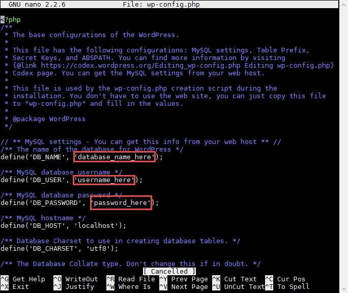

.. _InstallWordpress:

WordPress Installation
======================

Install
-------

While there is a apt-get package called "wordpress", the way Ubuntu installs
WordPress is terrible. I lost a lot of time trying to debug all the issues with
their install. So we'll just install WordPress manually. But we some of the
supporting software we'll use apt-get to install.

First, use MobaXTerm to "shell" out to our Amazon server.

Next, we need to install WordPress and a database. The database will help
keep track of everything for us. Enter these commands one-by-one.

::

    # Update the list of software we can get
    sudo apt-get update

    # Update to the most current versions of the software
    sudo apt-get -y upgrade

If you are using Ubuntu 16, you'll need to do this for the last line::

    sudo apt-get -y install mysql-server

Next, when it installs the database server, you'll get a screen that looks like the
image below. Store the password that you choose. Don't leave it blank.

This install will have you create three passwords:

* Password for the database server (a server can have multiple databases)
* Password for the WordPress database
* Password for the WordPress administrator

This one is for the **database server**.

.. image:: my_sql_password.png
    :width: 640px
    :align: center

.. attention::

    Wait! Use a good password. You are going to be working on systems that will
    have programs that automatically are trying to gain access to your system
    every minute. Literally.

    Don't use a common password. Leaks like the Adobe one of 150 million passwords
    show most people pick terrible passwords. Here is a
    `list of the 1000 most common passwords used at the Adobe site`_. Take a minute,
    read through those. Ever use one of these passwords?

    If you haven't already, use a password program like KeePass_ to generate random
    passwords and store them.

    Use an entire sentence as a password to protect that password database. I use KeePass, Google
    Drive, and an app on my phone so I can always get to these passwords and have them
    synchronized. Yes, I memorize a password with over 25 characters to it, but that is
    the _only_ password I have to remember.

.. _KeePass: https://keepass.info/
.. _list of the 1000 most common passwords used at the Adobe site: https://github.com/danielmiessler/SecLists/blob/master/Passwords/10_million_password_list_top_1000.txt

Next, install these software packages::

    sudo apt-get -y install php7.0 libapache2-mod-php7.0 php-mcrypt php-mysql

This next part creates the database and user for WordPress. Instead of
``yourdbserverpassword`` please use the password you entered above for your
database.

You will also see that there is a ``yourdbpassword``. This is different than
the ``yourdbserverpassword``. It is the password for just the WordPress database.
Make up a new password for ``yourdbpassword``.

::

    # Create a database for WordPress.

    # Set the database so we can enter commands to it.
    mysql -u root -p

    # Ok, at this point it should ask you to enter the database password, so
    # do that.
    yourdbserverpassword

    # Create a new user for your database called "wordpress-db"
    # You need to create a password for the wordpress user that will manage your
    # wordpress database. This is different than the 'root' user/password that was
    # the admin user for the whole database server.
    CREATE USER 'wordpress-db'@'localhost' IDENTIFIED BY 'yourdbpassword';

    # Create a new database, also called "wordpress-db"
    # IMPORTANT IMPORTANT IMPORTANT
    # This command and the next one contain back-ticks. Carefully note when
    # the tutorial calls for you to use ` or '. Also watch what prints out
    # and see if it prints an error.
    CREATE DATABASE `wordpress-db`;

    # Say that the wordpress user can do everything with the wordpress database
    GRANT ALL PRIVILEGES ON `wordpress-db`.* TO "wordpress-db"@"localhost";

    # Commit our changes
    FLUSH PRIVILEGES;

    # Leave
    exit

Now we need to download and unzip WordPress.

::

    # --- Get WordPress
    # Switch to the home directory
    cd ~

    # Download WordPress from the Internet
    wget https://wordpress.org/latest.tar.gz

    # Unzip the file
    tar -xzf latest.tar.gz

Copy the sample configuration file and get it ready for editing::

    # Change to the WordPress folder we just unzipped
    cd wordpress/
    # Copy sample config file as a template for our real config file
    cp wp-config-sample.php wp-config.php

Next, we need to edit the configuration file::

    nano wp-config.php

Replace the default with the database name ``wordpress-db`` and the database
user, also ``wordpress-db``. Next, fill in the password ``yourdbpassword``.
This is the password for the WordPress database, **not** the password for the
database server.
Then save the file.

In the example below, instead of ``my_sample_project``, please replace that with the
directory of your actual project. If you didn't use ``public_html``, then you'll need
to adjust the path appropriately. Don't just blindly copy that line and hope it works.
Use ``cd`` and ``ls`` commands to make sure that ``wordpress`` goes into the correct
directory.

::

    # Go up a directory
    cd ..

    # Move the WordPress directory to a directory that the web server sees.
    sudo mv wordpress /var/www/my_sample_project/public_html

    # Change ownership to the apache process and group (www-data)
    sudo chown -R www-data:www-data /var/www

Now, go to your webserver. Because we created a "wordpress" subdirectory, you'll
need to add that to your URL. It will look something like::

    http://XXXPUT_YOUR_SERVER_NAME_HEREXXX/wordpress/

Then you should end up with a WordPress installation screen, which should be
rather straight-forward.

Make sure your password is a good password. There are automatic scripts that
run by hackers that will attempt to log into your WordPress site every single
hour it is up.

.. image:: setup.png
    :width: 640px
    :align: center

After that, you'll be taken to the WordPress dashboard that lets you administer,
add, and delete content.

.. image:: dashboard.png
    :width: 640px
    :align: center

Play around with WordPress at least enough that you can figure out how to put your
name on the main page. Our next assignment will involve putting more content
on the page. We just need enough here that you can turn in a URL that shows
you have WordPress up and running. But feel free to explore WordPress and learn.

Updating
--------

The WordPress software needs to be updated on a regular basis. Also, WordPress
has software plug-ins that need to be updated. You can update both rather easily
from the update screen:

.. image:: updating.png
    :width: 500px
    :align: center

.. _WordPress: https://en.wikipedia.org/wiki/WordPress
.. _Content Management System: https://en.wikipedia.org/wiki/Content_management_system
